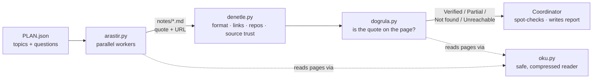

<p align="center">
  
</p>

<p align="center">
  <b>An evidence-first research skill for AI agents.</b><br>
  Cheap parallel workers do the searching. Nothing they write is trusted until plain Python has found their quotes on the pages they cite.
</p>

<p align="center">
  <a href="README.md">English</a> · <a href="README.tr.md">Türkçe</a>
  &nbsp;|&nbsp;
  
  
  
</p>

---

## In 30 seconds

AI research agents are fluent, fast — and they **invent quotes**. The usual fix is to ask a second LLM to fact-check the first, which is slow, costs tokens, and tends to fail in the same ways.

Quoteproof makes the claim itself checkable. Every finding a worker writes must be a **word-for-word quote in the page's original language, plus a URL**. A script with **zero LLM tokens** then opens each cited page and looks for that exact text.

```text
What a worker wrote (illustrative)                       What Quoteproof says
─────────────────────────────────────────────────────    ──────────────────────────────────────────
"uv is 100x faster than pip"        — docs.example.org    ✗ Not found  the quote is not on that page
"10-100x faster than pip"           — github.com/…/uv     ✓ Verified   found on the cited page
"a paraphrase nobody can locate"    — blog.example.com    ✗ Not found  paraphrases cannot be verified
```

Only what survives that check goes to the coordinating model for final review and the written report.

> **Measured on the author's own runs:** requiring verbatim quotes raised the share of findings that could be auto-verified from **3 of 14 to about 14 of 15**. A later round of checker fixes took one real run from **7 of 21 to 19 of 21** verified; the remainder were legitimate paraphrases correctly flagged for a human look.

## The idea

| | Step | Who does it | Cost |
|---|---|---|---|
| 1 | **Plan** — split the question into topics | the coordinating model | one call |
| 2 | **Research** — search, read, write notes in a fixed format | cheap workers, in parallel | cheap |
| 3 | **Audit** — format, dead links, repo activity, source trust | Python | 0 tokens |
| 4 | **Verify** — is every quote / number / version really on the page? | Python | 0 tokens |
| 5 | **Review & write** — spot-check meaning, write the report | the coordinating model | a few calls |

The single rule that made the difference: **quote verbatim, in the original language — or don't quote.** A translated "quote" can never be found on the page, so it can never pass.

## How it works



### A note, as a worker writes it

Workers must produce notes in one fixed shape. (The section names are Turkish because the tools parse them; the content can be in any language.)

```markdown
## How does the official documentation describe uv's speed?
### Özet
One or two sentences with the main takeaway.
### Alıntılı bulgular
- uv advertises 10–100× the speed of pip — "10-100x faster than pip" — [uv README](https://github.com/astral-sh/uv) (2026-10, birincil)
### Çıkarımlar
- The worker's own inference (clearly separate from the findings).
### Boşluklar
- What it could not find, and why.
```

Each finding line carries **the claim**, **a verbatim quote**, **a URL of its own**, and a tag with the date and whether the source is primary (`birincil`) or secondary (`ikincil`).

### What the verdicts mean

| Verdict | Meaning | What you do |
|---|---|---|
| **Verified** (*Doğrulandı*) | Every quote, number, version and code token was found on the cited page. | Still spot-check *meaning* on claims that matter. |
| **Partial** (*Kısmen*) | Some evidence was found, or only a single weak item (one lone number) matched. | Open the page; read the context. |
| **Not found** (*Bulunamadı*) | Most of the evidence is missing — invented, translated, or taken from a different page. | Do not use it. `--temiz-yaz` writes a clean copy of the notes without these. |
| **Unreachable** (*Erişilemedi*) | The page could not be read: blocked by robots.txt, needs JavaScript, timed out. | Open it yourself, or find a second source. |
| **No evidence** (*Kanıt yok*) | The finding has no quote or number to look up. | Manual review. |

*Verified* means **the quoted text is on the cited page**. It does not mean the page is right. That is what the trust score, a second source and your own spot-checks are for.

### What is inside

| Script | Role | Cost |
|---|---|---|
| `arastir.py` | Runs the workers in parallel, retries, falls back across back-ends, writes `notes/<slug>.md`, then runs the audit and verification | cheap model |
| `denetle.py` | Audits notes: format, link liveness, GitHub repository existence/activity, **source trust**, picks claims worth a manual look | 0 tokens |
| `dogrula.py` | Looks up every quote / number / version / code token on the cited page and issues verdicts | 0 tokens |
| `oku.py` | The page reader: main content only, BM25 passage selection (≈20–40× fewer tokens than a full page), PDF and GitHub-README aware | 0 tokens |
| `mcp_oku.py` | Exposes the reader to workers as a tiny MCP server | 0 tokens |
| `guven.py` | 0–100 source credibility heuristic | 0 tokens |
| `rapor_olc.py` | Measures two reports with the same yardstick (words, headings, sources, gaps) | 0 tokens |

## Features, explained

- **Verbatim-quote contract.** A finding without a checkable quote does not reach the report. This one rule is what turns "the model says so" into "the page says so".
- **Every finding is checked — not a sample.** The report states its own coverage (tried / no evidence / skipped), so a gap can't hide.
- **Boundary-aware matching.** `1.2` is not found inside `11.20`; `values[0]` is not `values0`; `v1.2.3` matches `1.2.3`; number formats are reconciled (`%26,2` ↔ `26.2%`, `100.000` ↔ `100,000`); deliberate `...` and editorial `[the]` inside a quote are tolerated.
- **Resumable runs.** `--devam` re-uses topics that already finished (the prompt hash must match). A checkpoint is written atomically after every topic, so a killed run loses nothing.
- **Fail-closed workers.** A worker that asks for approval instead of researching, cites fewer than 3 distinct URLs, or never called a search/read tool is rejected and the next back-end takes over.
- **Source trust score** (*a priority signal, never proof*). Starts from the domain's class, then adjusts for URL signals:

  | Class | Points | | Signal | Points |
  |---|---:|---|---|---:|
  | Official / standards body | 90 | | Source named in your plan | +10 |
  | Academic publisher | 85 | | Plain `http` | −10 |
  | Official documentation | 80 | | Listicle / SEO-style URL | −8 |
  | Preprint · news | 70 | | Suspicious TLD | −10 |
  | Code host | 65 | | IP-address host | −15 |
  | Encyclopedia | 60 | | Tracking parameters | −3 |
  | Community / social | 25–55 | | | |
  | Unknown | 50 | | | |

  It also raises flags: *weak source*, *"primary" claimed but the domain isn't*, and *stale* (reported date older than 18 months).
- **A polite reader.** It follows robots.txt, rate-limits per host, and honours `Crawl-delay`.

## Safety by design

Web pages are hostile input. The design assumes a worker *will* be handed instructions by a page.

| Threat | What the design does |
|---|---|
| A page tells the worker to "ignore previous instructions" | Workers get a **deny-by-default tool allow-list**: search and read only. A hijacked worker cannot run commands, read local files or call other services. Fetched text is labelled *data, not instructions*, and common injection phrases are flagged. |
| The reader is steered at an internal address (SSRF) | Only `http(s)`, only globally-routable addresses. Loopback, private, link-local, carrier-grade NAT and IPv4-mapped IPv6 ranges are blocked. |
| DNS rebinding | DNS is resolved once and the connection is **pinned to the validated IP** (Host/SNI preserved). |
| A redirect that lands somewhere internal | Every redirect hop is re-validated and re-checked against robots.txt. No proxy is used. |
| Huge or deliberately slow responses | Size caps (2 MB; PDF 10 MB) and a **total** deadline covering DNS, redirects and body. |
| Impolite crawling | robots.txt (RFC 9309) on every content request, a per-host rate limit, `Crawl-delay`. Workers cannot switch it off. |
| A hostile robots.txt file | The matcher is regex-free (no ReDoS) with caps on rule count, pattern length and file size. |
| Secrets in logs or child processes | Child processes get an environment allow-list; keys are redacted from error text. |
| A poisoned cache | Atomic, schema-validated cache keyed by URL and fetch mode; 6-hour TTL. |

The code has been through two independent LLM-assisted security reviews. Every finding they raised was reproduced offline before it was fixed, and each fix has a regression test.

## Getting started

### Requirements

- **Python 3.9 or newer.** No third-party packages.
- **To run the research workers:** a command-line agent runtime with a web-search tool, and an LLM account of your choice. The worker back-end is configured in one small JSON file (models, key location, optional command-line back-end) — nothing provider-specific is hard-coded.
- *Optional:* `gh` (GitHub repository checks) and `pdftotext` (PDF pages).

The reader, auditor, verifier and trust scorer need **no model, no account and no key** — they are useful on their own.

### Install (as a Claude Code skill)

```bash
git clone https://github.com/mesutbsdgn/quoteproof.git
mkdir -p ~/.claude/skills
ln -s "$PWD/quoteproof/arastir-ogren" ~/.claude/skills/arastir-ogren
```

The skill folder is called `arastir-ogren` ("research and learn" in Turkish). `SKILL.md` is written in Turkish for the author's workflow — adapt it freely.

### Configure (only for the research workers)

```bash
mkdir -p ~/.config/quoteproof
cp quoteproof/arastir-ogren/quoteproof.example.json ~/.config/quoteproof/config.json   # then fill in your models and key location
python3 ~/.claude/skills/arastir-ogren/scripts/ayar.py                                   # prints the status (never the key itself)
```

The file names your models, the *name* of the environment variable that holds your key (and optional key files), and — optionally — a command-line back-end template (the command may print JSON or just plain text; with `"format": "text"` its whole output is the note, so almost any agent CLI can act as a worker; with `"prompt_via": "stdin"` the prompt is piped to its standard input instead of the command line — handy for CLIs that read stdin and for very long prompts). It is read from `QUOTEPROOF_CONFIG`, `./quoteproof.json` or `~/.config/quoteproof/config.json`, and is git-ignored.

### Run a research

```bash
S=~/.claude/skills/arastir-ogren/scripts

# 1) research: workers run in parallel (about 30 s per small topic in our runs)
python3 $S/arastir.py PLAN.json -d my-research -j 3 -e dusuk
#    interrupted?  add  --devam  to continue where it stopped

# 2) audit + verification run automatically; re-run any time, for free:
python3 $S/denetle.py my-research/notlar --plan PLAN.json
python3 $S/dogrula.py my-research/notlar --plan PLAN.json --temiz-yaz my-research/notlar-temiz
```

`PLAN.json` is a list of topics:

```json
[
  {
    "slug": "uv-speed",
    "konu": "Speed claims of the uv Python package manager",
    "amac": "Check the official wording of the pip comparison",
    "sorular": ["How does the official documentation state uv's speed advantage over pip?",
                "What is the current stable version?"],
    "kaynaklar": "docs.astral.sh, github.com/astral-sh/uv",
    "kisitlar": "primary sources only"
  }
]
```

Listing expected sources in `kaynaklar` both steers the worker and gives those domains +10 trust.

### Use the tools on their own

```bash
S=arastir-ogren/scripts
python3 $S/oku.py https://docs.astral.sh/uv/ --soru "pip compatibility" --token 600   # short, relevant passages only
python3 $S/oku.py URL --ara "10-100x faster"        # does this phrase / number appear on the page? (with context)
python3 $S/oku.py URL --robots                      # does robots.txt allow it?
python3 $S/oku.py URL --llms                        # the site's llms.txt index, if any
python3 $S/guven.py https://medium.com/x https://docs.python.org/3/   # source trust score + reasons
```

### A verification report (abridged; values taken from real runs)

```text
Summary: Verified 19 · Partial 2   (21 findings, all checked)
| Verdict    | Evidence | Claim                                              | Source         | Trust |
|------------|---------:|----------------------------------------------------|----------------|------:|
| Verified   |      3/3 | Release 0.12.23 was published on 2026-10-03        | github.com     |    75 |
| Verified   |      2/2 | "10-100x faster than pip" (feature list)           | docs.astral.sh |    85 |
| Partial    |      1/2 | v2 added standard link relations …                 | llmstxt.org    |    60 |
```

### Exit codes (`arastir.py`)

`0` success · `64` bad plan · `69` no usable back-end · `70` no worker succeeded · `71` auditor crashed · `72` verifier did not run (verify by hand!) · `73` partial (some topics failed or were thin) · `78` configuration missing or invalid.

## FAQ

**Why not just ask another LLM to fact-check?**
Because it can be wrong in the same way, and it costs tokens for every claim. A string lookup on the cited page is cheap, deterministic and reproducible — and it targets the exact failure that hurts most: invented or mistranslated quotes.

**Does "Verified" mean the claim is true?**
No. It means the quoted text is on the cited page. Whether the page is right is a separate question — that is the job of the trust score, a second source, and a human (or a coordinating model) spot-checking the claims that matter.

**Do I need a particular model or vendor?**
The checking tools need none. The research workers need an agent runtime and an LLM account, configured in one small JSON file. See [Requirements](#requirements).

**Why are some names Turkish?**
The tool began as a Turkish-language workflow. Section names in notes (`Özet`, `Alıntılı bulgular`, …) and command-line flags are Turkish and are part of the format the parsers read; the *content* can be in any language, and quotes always stay in the source's language.

**How slow is it?**
In our runs, a small topic takes about 30 seconds per worker, and the audit + verification of a whole run takes a few seconds of CPU plus the time to fetch the cited pages.

## Limitations

- Verification is **textual**, not semantic: a quote can be on the page and still be misread. Check meaning on the claims that matter.
- Trust scoring is a hand-written heuristic over domains and URL shapes; it will mis-rank unusual sites. Treat it as a triage hint.
- Workers need an agent runtime that is already set up with your LLM provider; this project only tells it which model ids and key variable to use. A different runtime needs a new back-end function in `scripts/arastir.py`.
- JavaScript-only pages cannot be read without a browser. A third-party reader option exists (`--jina`) but it sends the URL to a third party, so it is opt-in and never used by workers.
- Worker prompts, notes and reports are Turkish by default (quotes stay in the source language).
- The test suites are offline unit tests; the live pipeline has been exercised end-to-end by hand, not in CI.

## Tests

```bash
python3 arastir-ogren/scripts/test_arastir.py   # 115 tests: parsing, contract, resume, verification, trust score, config, MCP server
python3 arastir-ogren/scripts/test_oku.py       # 50 tests: extraction, BM25, cache, SSRF, redirects, robots.txt, PDF
```

Both suites run without network access.

## Repository layout

```text
arastir-ogren/            the skill (copy or symlink into ~/.claude/skills/)
├── SKILL.md              coordinator instructions (Turkish)
├── quoteproof.example.json   configuration template (copy to ~/.config/quoteproof/config.json)
├── references/           worker prompt, report template, notes behind the design
└── scripts/              arastir · denetle · dogrula · oku · mcp_oku · guven · rapor_olc · ayar  (+ tests)
assets/                   logo
docs/fact-check/          the fact-check of this README (see below)
```

## License

MIT — see [LICENSE](LICENSE).

---

## Fact-check

The claims in this README that rest on **external standards and tools** — how robots.txt must be interpreted (RFC 9309), the carrier-grade NAT address range (RFC 6598), what BM25 and DNS rebinding are, what `llms.txt` proposes, and the speed claim used in the example — were checked with this project's own verifier, `dogrula.py`, on 2026-10-08:

> **9 of 9 quotes were found on the cited pages.**

The notes and the generated report are in [`docs/fact-check/`](docs/fact-check/). As always, this shows that the quoted text is on the page, not that the page is right; claims about this project's own behaviour (test counts, measured ratios) are covered by the test suites and the author's run logs instead.
