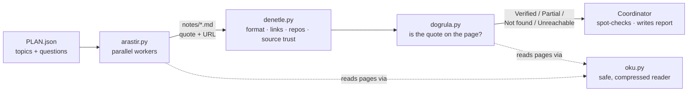

<p align="center">
  
</p>

<p align="center">
  <b>An evidence-first research pipeline that catches the quotes AI agents invent.</b><br>
  Cheap parallel workers do the searching. A finding is trusted only once plain Python has found its quote, word for word, on the page it cites.
</p>

<p align="center">
  <a href="README.md">English</a> · <a href="README.tr.md">Türkçe</a>
  &nbsp;|&nbsp;
  
  
  
</p>

---

## In 30 seconds

AI research agents write fluently and fast, but they **invent quotes**. The usual fix is to ask a second LLM to fact-check the first. That is slow, costs tokens, and tends to fail in the same ways.

Quoteproof does not hand that check to another model; it looks at **the source itself**. It works in three steps:

1. **A strict rule:** the cheap search models (called *workers* in this document) must write every finding as a **word-for-word quote in the page's original language, plus a URL**.
2. **A zero-token check:** a Python script that calls **no LLM** opens each cited page and looks for the quote, number and version.
3. **Synthesis:** findings that fail are flagged or dropped. The rest go to the **coordinating model**, the main model that does the final review and writes the report.

```text
What a worker wrote (illustrative)                       What Quoteproof says
─────────────────────────────────────────────────────    ──────────────────────────────────────────
"uv is 100x faster than pip"        — docs.example.org    ✗ Not found  the quote is not on that page
"10-100x faster than pip"           — github.com/…/uv     ✓ Verified   found on the cited page
"a paraphrase nobody can locate"    — blog.example.com    ✗ Not found  paraphrases cannot be verified
```

> **Measured on the author's own runs:** requiring verbatim quotes raised the share of findings that could be auto-verified from **3 of 14 to about 14 of 15**. A later round of checker fixes took one real run from **7 of 21 to 19 of 21** verified; the remainder were legitimate paraphrases correctly flagged for a human look.

## The idea

| | Step | Who does it | Cost |
|---|---|---|---|
| 1 | **Plan**: split the question into topics | the coordinating model | one call |
| 2 | **Research**: search, read, write notes in a fixed format | cheap workers, in parallel | cheap |
| 3 | **Audit**: format, dead links, repo activity, source trust | Python | 0 tokens |
| 4 | **Verify**: is every quote, number and version really on the page? | Python | 0 tokens |
| 5 | **Review & write**: spot-check meaning, write the report | the coordinating model | a few calls |

The single rule that made the difference: **quote verbatim, in the original language, or don't quote.** A translated "quote" can never be found on the page, so it can never pass.

## How it works



### A note, as a worker writes it

Workers must produce notes in one fixed shape. (The section names are Turkish because the tools parse them; the content can be in any language.)

```markdown
## How does the official documentation describe uv's speed?
### Özet
One or two sentences with the main takeaway.
### Alıntılı bulgular
- uv advertises 10–100× the speed of pip — "10-100x faster than pip" — [uv README](https://github.com/astral-sh/uv) (2026-10, birincil)
### Çıkarımlar
- The worker's own inference (clearly separate from the findings).
### Boşluklar
- What it could not find, and why.
```

Each finding line carries **the claim**, **a verbatim quote**, **a URL of its own**, and a tag with the date and whether the source is primary (`birincil`) or secondary (`ikincil`).

### What the verdicts mean

| Verdict | Meaning | What you do |
|---|---|---|
| **Verified** (*Doğrulandı*) | Every quote, number, version and code token was found on the cited page. | Still spot-check *meaning* on claims that matter. |
| **Partial** (*Kısmen*) | Some evidence was found, only a single weak item (one lone number) matched, or the quote's words are on the page exactly and only punctuation differs. | Open the page; read the context. |
| **Not found** (*Bulunamadı*) | Most of the evidence is missing — invented, translated, shortened or taken from a different page. The nearest page passage is shown when one exists. | Do not use it. `--temiz-yaz` writes a clean copy of the notes without these. |
| **Unreachable** (*Erişilemedi*) | The page could not be read: blocked by robots.txt, needs JavaScript, timed out. | Open it yourself, or find a second source. |
| **No evidence** (*Kanıt yok*) | The finding has no quote or number to look up. | Manual review. |

*Verified* means **the quoted text is on the cited page**. It does not mean the page is right. That is what the trust score, a second source and your own spot-checks are for.

### What is inside

| Script | Role | Cost |
|---|---|---|
| `arastir.py` | Runs the workers in parallel, retries, falls back across back-ends, writes `notes/<slug>.md`, then runs the audit and verification | cheap model |
| `denetle.py` | Audits notes: format, link liveness, GitHub repository existence/activity, **source trust**, picks claims worth a manual look | 0 tokens |
| `dogrula.py` | Looks up every quote / number / version / code token on the cited page and issues verdicts | 0 tokens |
| `oku.py` | The page reader: main content only, BM25 passage selection (≈20–40× fewer tokens than a full page), PDF and GitHub-README aware | 0 tokens |
| `mcp_oku.py` | Exposes the reader to workers as a tiny MCP server | 0 tokens |
| `guven.py` | 0–100 source credibility heuristic | 0 tokens |
| `rapor_kontrol.py` | Checks the **final report** against the pages it cites: catches numbers pinned to the wrong subject, quotes that are not verbatim, citations that never appeared in the research notes | 0 tokens |
| `uzlas.py` | Merges the verified notes of several independent runs of the same topic: which claims were found in how many runs, what only one run found, and a merged note whose findings carry `[k/N çalıştırma]` (k of N runs) | 0 tokens |
| `rapor_olc.py` | Measures two reports with the same yardstick (words, headings, sources, gaps) | 0 tokens |

## Features, explained

- **Verbatim-quote contract.** A finding without a checkable quote does not reach the report. This one rule is what turns "the model says so" into "the page says so".
- **Every finding is checked — not a sample.** The report states its own coverage (tried / no evidence / skipped), so a gap can't hide.
- **Boundary-aware matching.** `1.2` is not found inside `11.20`; `values[0]` is not `values0`; `v1.2.3` matches `1.2.3`; number formats are reconciled (`%26,2` ↔ `26.2%`, `100.000` ↔ `100,000`); deliberate `...` and editorial `[the]` inside a quote are tolerated.
- **Context check.** For claims that carry a number, a distinctive term in the claim sentence must appear near the verified quote on the page; otherwise the verdict drops from *Verified* to *Partial* with the reason written down. A cheap heuristic (well under 1% of findings in real runs), not proof.
- **Report-level check.** Errors are often born at *synthesis*: the note was right, the report pinned the number on the wrong subject. `rapor_kontrol.py` re-checks the finished report item by item (table rows, bullets, quotes) against the cited pages. It is a heuristic: a clean result means these error classes were not seen, not that the report is right.
- **Resumable runs.** `--devam` re-uses topics that already finished (the prompt hash must match). A checkpoint is written atomically after every topic, so a killed run loses nothing.
- **Fail-closed workers.** A worker that asks for approval instead of researching, cites fewer than 3 distinct URLs, or never called a search/read tool is rejected and the next back-end takes over.
- **Source trust score** (*a priority signal, never proof*). Starts from the domain's class, then adjusts for URL signals:

  | Class | Points | | Signal | Points |
  |---|---:|---|---|---:|
  | Official / standards body | 90 | | Source named in your plan | +10 |
  | Security standards (OWASP, MITRE, CVE, CERT) | 88 | | Plain `http` | −10 |
  | Academic publisher | 85 | | Listicle / SEO-style URL | −8 |
  | Official documentation | 80 | | Suspicious TLD | −10 |
  | Preprint · news | 70 | | IP-address host | −15 |
  | Code host | 65 | | Tracking parameters | −3 |
  | Encyclopedia | 60 | | | |
  | Community / social | 25–55 | | | |
  | Unknown | 50 | | | |

  It also raises flags: *weak source*, *"primary" claimed but the domain isn't*, and *stale* (reported date older than 18 months).
- **A polite reader.** It follows robots.txt, rate-limits per host, and honours `Crawl-delay`.

## Safety by design

Web pages are hostile input. The design assumes a worker *will* be handed instructions by a page.

| Threat | What the design does |
|---|---|
| A page tells the worker to "ignore previous instructions" | OpenCode workers get a **deny-by-default tool allow-list**: search and read only. A hijacked worker cannot run commands, read local files or call other services. Fetched text is labelled *data, not instructions*, and common injection phrases are flagged. |
| The reader is steered at an internal address (SSRF) | Only `http(s)`, only globally-routable addresses. Loopback, private, link-local, carrier-grade NAT and IPv4-mapped IPv6 ranges are blocked. |
| DNS rebinding | DNS is resolved once and the connection is **pinned to the validated IP** (Host/SNI preserved). |
| A redirect that lands somewhere internal | Every redirect hop is re-validated and re-checked against robots.txt. No proxy is used. |
| Huge or deliberately slow responses | Size caps (2 MB; PDF 10 MB) and a **total** deadline covering DNS, redirects and body. |
| Impolite crawling | robots.txt (RFC 9309) on every content request, a per-host rate limit, `Crawl-delay`. Workers cannot switch it off. |
| A hostile robots.txt file | The matcher is regex-free (no ReDoS) with caps on rule count, pattern length and file size. |
| Secrets in logs or child processes | OpenCode and MCP child processes get only allow-listed environment variables (plus the configured key); some key-like values in error text are masked. The scope is narrow, see [Limitations](#limitations). |
| A poisoned cache | Atomic, schema-validated cache keyed by URL and fetch mode; 6-hour TTL. |

The code has been through two independent LLM-assisted security reviews. Every finding they raised was reproduced offline before it was fixed, and each fix has a regression test. This table applies to the OpenCode workers and the reader; the limits of a custom CLI back-end are described under [Limitations](#limitations).

## Getting started

### Requirements

- **Python 3.9 or newer.** No third-party packages.
- **To run the research workers:** a command-line agent runtime with a web-search tool, and an LLM account of your choice. The worker back-end is configured in one small JSON file (models, key location, optional command-line back-end) — nothing provider-specific is hard-coded.
- *Optional:* `gh` (GitHub repository checks; `gh` handles its own authentication) and `pdftotext` (PDF pages).

The reader, auditor, verifier and trust scorer need **no model, no account and no key** — they are useful on their own.

### Install (as a Claude Code skill)

```bash
git clone https://github.com/mesutbsdgn/quoteproof.git
mkdir -p ~/.claude/skills
ln -s "$PWD/quoteproof/arastir-ogren" ~/.claude/skills/arastir-ogren
```

The skill folder is called `arastir-ogren` ("research and learn" in Turkish). `SKILL.md` is written in Turkish for the author's workflow — adapt it freely.

### Configure (only for the research workers)

```bash
mkdir -p ~/.config/quoteproof
cp quoteproof/arastir-ogren/quoteproof.example.json ~/.config/quoteproof/config.json   # then fill in your models and key location
python3 ~/.claude/skills/arastir-ogren/scripts/ayar.py                                   # prints the status (never the key itself)
```

The worker key is passed to OpenCode; GitHub authentication is handled by `gh` (Quoteproof does not hold a GitHub token).

The file names your models, the *name* of the environment variable that holds your key (and optional key files), and, optionally, a command-line back-end template.

- The command may print JSON or plain text. With `"format": "text"` its whole output is the note, so almost any agent CLI can act as a worker.
- With `"prompt_via": "stdin"` the prompt is piped to the command's standard input instead of the command line, which suits CLIs that read stdin and very long prompts.
- The configured key is not passed to a custom CLI. The CLI receives only allow-listed environment variables and must use its own session or configuration. Its security limits are listed under [Limitations](#limitations).
- The file is looked up in `QUOTEPROOF_CONFIG`, then `quoteproof.json` in the skill folder, then `~/.config/quoteproof/config.json`. It is git-ignored.

### Run a research

```bash
S=~/.claude/skills/arastir-ogren/scripts

# 1) research: workers run in parallel (about 30 s per small topic in the author's runs)
python3 $S/arastir.py PLAN.json -d my-research -j 3 -e dusuk
#    interrupted?  add  --devam  to continue where it stopped

# 2) audit + verification run automatically; re-run any time, for free:
python3 $S/denetle.py my-research/notlar --plan PLAN.json
python3 $S/dogrula.py my-research/notlar --plan PLAN.json --temiz-yaz my-research/notlar-temiz
```

`PLAN.json` is a list of topics:

```json
[
  {
    "slug": "uv-speed",
    "konu": "Speed claims of the uv Python package manager",
    "amac": "Check the official wording of the pip comparison",
    "sorular": ["How does the official documentation state uv's speed advantage over pip?",
                "What is the current stable version?"],
    "kaynaklar": "docs.astral.sh, github.com/astral-sh/uv",
    "kisitlar": "primary sources only"
  }
]
```

Listing expected sources in `kaynaklar` both steers the worker and gives those domains +10 trust.

For a deliberately narrow topic add `"min_url": 3` (any whole number from 3 to 30). A note with fewer distinct URLs than that is flagged as weak (exit code `73`); the default threshold is 8.

### Use the tools on their own

```bash
S=arastir-ogren/scripts
python3 $S/oku.py https://docs.astral.sh/uv/ --soru "pip compatibility" --token 600   # short, relevant passages only
python3 $S/oku.py URL --ara "10-100x faster"        # does this phrase / number appear on the page? (with context)
python3 $S/oku.py URL --robots                      # does robots.txt allow it?
python3 $S/oku.py URL --llms                        # the site's llms.txt index, if any
python3 $S/guven.py https://medium.com/x https://docs.python.org/3/   # source trust score + reasons
```

### A verification report (abridged; values taken from real runs)

```text
Summary: Verified 19 · Partial 2   (21 findings, all checked)
| Verdict    | Evidence | Claim                                              | Source         | Trust |
|------------|---------:|----------------------------------------------------|----------------|------:|
| Verified   |      3/3 | Release 0.12.23 was published on 2026-10-03        | github.com     |    75 |
| Verified   |      2/2 | "10-100x faster than pip" (feature list)           | docs.astral.sh |    85 |
| Partial    |      1/2 | v2 added standard link relations …                 | llmstxt.org    |    60 |
```

### Exit codes (`arastir.py`)

`0` success · `64` bad plan · `69` no usable back-end · `70` no worker succeeded · `71` auditor crashed · `72` verifier did not run (verify by hand!) · `73` partial (some topics failed or were thin) · `78` configuration missing or invalid.

## FAQ

**Why not just ask another LLM to fact-check?**
Because it can be wrong in the same way, and it costs tokens for every claim. A string lookup on the cited page is cheap, deterministic and reproducible — and it targets the exact failure that hurts most: invented or mistranslated quotes.

**Does "Verified" mean the claim is true?**
No. It means the quoted text is on the cited page. Whether the page is right is a separate question — that is the job of the trust score, a second source, and a human (or a coordinating model) spot-checking the claims that matter.

**Do I need a particular model or vendor?**
The checking tools need none. The research workers need an agent runtime and an LLM account, configured in one small JSON file. See [Requirements](#requirements).

**Why are some names Turkish?**
The tool began as a Turkish-language workflow. Section names in notes (`Özet`, `Alıntılı bulgular`, …) and command-line flags are Turkish and are part of the format the parsers read; the *content* can be in any language, and quotes always stay in the source's language.

**Can I check an answer that was written without the skill?**
Yes, and it costs no model tokens: `python3 scripts/rapor_kontrol.py answer.md`. It reads the pages the answer cites (full `https://…` addresses, markdown links and scheme-less `domain.tld/path` addresses) and flags quoted passages that are not on the page, numbers that are not there, and answers with no readable source at all. To make an answer checkable, add one sentence to the request: "Give a full https:// URL with every fact and, where possible, a verbatim quote of at most 25 words from the page." In a test with a plain prompt plus that sentence, the answers came out checkable in both tasks (6 and 8 quotations, 5 and 8 addresses; the check found 2 and 1 quotations that were not on the page) at about the cost of the plain prompt. A model that ignores the sentence still comes back with "cannot be checked". On a plain answer with no such sentence the check found two quoted passages that were in fact translations put between quotation marks.

**How do I get a more complete and more consistent result?**
Run the topic more than once and merge. One run found about 80% of the key facts of a topic and varied a lot from run to run (the weakest of five runs found 8 of 12, the best 12 of 12). On two topics, the union of two runs covered about 91–92% and the union of three about 95–96% (the fact lists were written by hand from what the runs found, so these are approximate figures, not a benchmark). With `--hafif` a run costs about as much as a plain prompt, so three runs cost about one full-mode run. Run each into its own folder, then `python3 scripts/uzlas.py RUN1/notlar-temiz RUN2/notlar-temiz RUN3/notlar-temiz --cikti uzlasi.md --yaz merged/`. The merged notes pass `dogrula.py` again (35 of 35 verified in the test) and every finding carries `[k/N çalıştırma]` (k of N runs); a claim found by a single run is listed as "do not trust alone". Mix two different models if you can: runs of the same model repeat each other's gaps. In a test, three repeats of one model still covered only 9 of 12 and 11 of 13 key facts, and replacing one repeat by a different model added about one more fact on average (between 0.6 and 1.3 on the two topics, and none on one of them). Pinning the primary source pages in the plan made no reliable difference to consistency (it was a little cheaper).

**What does it cost?**
Measured on two narrow topics (two questions each) with a small low-cost model, from the raw event logs. Input read from the provider's cache is listed apart because it is billed far below fresh input.

| Run | Fresh input | Cached input | Output + reasoning | Steps | Time |
|---|---:|---:|---:|---:|---:|
| Plain prompt, no skill (topic 1 / 2) | 16.3k / 14.6k | 19.5k / 6.1k | 1.0k / 1.7k | 3 / 2 | 33 s / 54 s |
| Full mode (topic 1 / 2) | 31.1k / 34.4k | 71.7k / 108.3k | 5.0k / 7.2k | 5 / 6 | 101 s / 151 s |
| `--hafif` (topic 1 / 2) | 16.6k / 14.8k | 22.5k / 17.4k | 2.8k / 2.9k | 3 / 3 | 52 s / 42 s |

The full mode costs more because search results (one search returns 12–24 thousand characters, eight results by default) stay in the context and are re-sent at every step, and because its budget is 10–15 searches. `--hafif` scales the budget to the number of questions, asks for at most four results per search and caps the steps at 12; the quote contract and the verification stay as they are. On the same topics 19 of its 22 quotes were found verbatim; the other three were real distortions (for example "Tomorrow's" where the page says "Yesterday's"). Use `--hafif` for narrow topics (one to three questions) and the full mode for broad ones. The verification itself spends no model tokens. One run per cell: the numbers vary from run to run (the same full-mode task read 152k and 103k input tokens in two runs).

**How slow is it?**
In the author's runs, a small topic takes about 30 seconds per worker, and the audit + verification of a whole run takes a few seconds of CPU plus the time to fetch the cited pages.

## Limitations

- Verification is **textual**, not semantic: a quote can be on the page and still be misread. Check meaning on the claims that matter.
- Trust scoring is a hand-written heuristic over domains and URL shapes; it will mis-rank unusual sites. Treat it as a triage hint.
- Workers need an agent runtime that is already set up with your LLM provider; this project only tells it which model ids and key variable to use. A different runtime needs a new back-end function in `scripts/arastir.py`.
- **The safety boundary does not cover a custom CLI back-end.** The deny-by-default tool permissions exist only for OpenCode. A custom CLI runs with an allow-listed environment and does not receive the `api_key_env` key; filtering environment variables does not restrict its file-system or network access. Run a CLI you do not trust in your own isolation (container, separate user).
- **Secret masking is limited.** A simple pattern masks only some key-like values in error text. Worker output, including the custom-CLI path, is written to the note file as is; there is no general sanitising guarantee. `denetle.py` runs the `gh` subprocess with the parent process's environment.
- JavaScript-only pages cannot be read without a browser. A third-party reader option exists (`--jina`) but it sends the URL to a third party, so it is opt-in and never used by workers.
- Worker prompts, notes and reports are Turkish by default (quotes stay in the source language).
- The reader uses no proxy and resolves DNS itself. In an environment where traffic can leave only through a proxy, online reading and quote verification do not work; the offline unit tests are unaffected.
- The test suites are offline unit tests; the live pipeline has been exercised end-to-end by hand, not in CI.
- **Reliability of live research is not yet established.** Three independent live trials were reported to the author; their run records are not part of this repository.
  - *First trial (two tasks):* both finished tasks failed the output contract and were moved to `hatali/`; the command-line fallback exited with a code that gave no usable diagnosis. The root cause was not isolated.
  - *Second trial (one task, medium effort, OpenCode only):* the note passed the contract (`rc=0`, four distinct URLs). Four URLs is below the weak-source threshold, so the whole run exited with `73`. The first verification confirmed 9 of 10 quotes; the tenth differed from the page only in punctuation (“FIPS 203” against “(FIPS) 203”). The verifier was changed afterwards to class that as *Partial*; the live task itself was not repeated.
  - *Third trial (three topics, low effort):* in two topics the OpenCode attempt failed (rate limit or step budget) and the command-line fallback produced accepted notes, so a third-party command-line back-end has now worked end to end once. The verifier of that day confirmed 24 of 54 findings and did not find 12; the current verifier, run again on the same notes, confirmed 34 and left 4 not found (their wording genuinely differs from the page). The rest were unreadable pages (robots.txt blocks, server errors).
  - *Fourth trial (one task, medium effort, OpenCode only, `min_url` set):* done in 87 s with 12 findings. The verifier of that moment found 7 verified, 1 partial, 4 not found. Two of the four were reader or verifier weaknesses, not bad quotes: the Google Security Blog keeps its article in a script template that the reader did not open, and a Firefox page returned almost no text. Both were fixed or relabelled *Unreachable* afterwards (see release notes); the other two did not match the page (one quotes the older wording of a document that is now an RFC).
  A handful of runs does not establish reliability. Treat the research workers as experimental and start with one small topic.

## Tests

```bash
python3 arastir-ogren/scripts/test_arastir.py   # 187 tests: parsing, contract, resume, verification, trust score, config, MCP server
python3 arastir-ogren/scripts/test_oku.py       # 54 tests: extraction, BM25, cache, SSRF, redirects, robots.txt, PDF
```

Both suites run without network access.

## Repository layout

```text
arastir-ogren/            the skill (copy or symlink into ~/.claude/skills/)
├── SKILL.md              coordinator instructions (Turkish)
├── quoteproof.example.json   configuration template (copy to ~/.config/quoteproof/config.json)
├── references/           worker prompt, report template, notes behind the design
└── scripts/              arastir · denetle · dogrula · rapor_kontrol · oku · mcp_oku · guven · rapor_olc · ayar  (+ tests)
assets/                   logo
docs/fact-check/          the fact-check of this README (see below)
```

## Release notes

There is no tagged release yet; entries are listed newest first, by commit. Measurements are detailed in the [closed issues](https://github.com/mesutbsdgn/quoteproof/issues?q=is%3Aissue+is%3Aclosed).

### Unreleased (documentation and license)

- **License changed from MIT to GNU AGPL-3.0.** Earlier commits (up to `2fa793e`) stay available under the MIT License.
- README rewritten; the Turkish text was simplified. In Turkish the search models are now called *alt ajan* (sub-agent) because *çalışan* means a human employee; "run" is now *çalıştırma/deneme*, not *koşu*; two headings were reworded.
- Safety wording narrowed: deny-by-default tool permissions and environment filtering apply to OpenCode workers only, and a custom CLI back-end is outside that boundary. Secret masking covers only some key-like values in error text.
- Config lookup path corrected (`quoteproof.json` in the skill folder, not `./quoteproof.json`).
- Added to Limitations: the reader uses no proxy, so it does not work where traffic can only leave through a proxy.
- Added to Limitations: an honest account of the first independent live trial (both finished tasks failed the output contract).
- Better failure diagnostics in `arastir.py`: a command-line back-end failure now reports the command, the exit code and the last meaningful output lines instead of a lone `}`; rate-limit (429) and step-budget exhaustion are reported as separate reasons; every attempt in `calisma.json` records its own token use and tool counts. Tests: 145 + 50.
- Verifier: for a quote that is not on the page it now shows the nearest page passage and the word overlap. When the words match exactly and only punctuation or spacing differs, the verdict is *Partial* (with the page's wording) instead of *Not found*. Found in the second independent trial: a quote shortened to “FIPS 203, …” where the page says “(FIPS) 203, …”. A changed word or number still gives *Not found*. Tests: 152 + 50.
- Verifier, found by re-checking a third live trial: matching now treats full-width CJK punctuation as ASCII (`（…）` ↔ `(…)`), ignores spaces next to Chinese/Japanese characters, decodes HTML entities (`&trade;` ↔ `™`) and ignores spacing in `+ 3.3` and `1.83 ×`. A changed word or number is still *Not found*. On the 54 findings of one real run it upgraded 8 findings (all checked by hand against the page text); the 4 that stay *Not found* genuinely differ from the page.
- Verifier: a page that failed for a transient reason (timeout, server error, 429, robots.txt network error) is retried once, sequentially; permanent failures (robots.txt block, 4xx, certificate) are not.
- Reader: MathML `<annotation>` (the TeX copy of a formula) is dropped, so arXiv pages no longer read `+3.3+3.3`. The page cache version is now v5; old caches are discarded once.
- Audit: the "stale date" flag is one summary line instead of one line per finding. Plan field `min_url` sets the weak-source threshold per topic. `rapor_kontrol.py` no longer warns that a document identifier (`RFC 9309`, `FIPS 203`, `CVE-…`) is missing from the cited pages. Research outputs (`arastirma/`) are git-ignored. Tests: 165 + 52.
- Found in the fourth live trial: the reader now opens the Blogger/Google Security Blog article body (it sits in a `<script type="text/template">`; only that narrow pattern is opened). When a page yields almost no text from a large HTML file (under 800 characters from over 20 KB, typically JavaScript-loaded content), a quote that is not found is reported as *Unreachable* with the reason, not as *Not found*. Inline HTML such as `<u>…</u>` left in page text is ignored when matching. Page cache version is now v6. Tests: 169 + 54.
- `rapor_kontrol.py` now warns when a report contains no `http(s)://` source URL at all (scheme-less addresses such as `kubernetes.io/blog/…` are not read). Before, such a report came out as "0 errors · 0 warnings" although nothing had been checked. Found while comparing runs made with and without the skill. Tests: 171 + 54.
- `--temiz-yaz` removes a finding whose quote is not on the page, but the same claim can live on in the note's summary. `DISLANAN.md` now lists the remaining lines that share a number or date with the removed finding (document numbers such as `PEP 779` and citation dates are ignored), so they can be checked by hand. Found when a removed "archived on 24 March 2026" quote left that sentence in the summary. Tests: 174 + 54.
- New `--hafif` mode for narrow topics. Measured with raw event logs, the full mode used 3–7 times the tokens of a plain prompt (search results of 12–24 thousand characters each, eight results by default, a 10–15 search budget; the cached-input part is billed far lower than fresh input). `--hafif` scales the search and call budget to the number of questions (searches = questions + 2, calls = 3 × questions + 2), asks for at most four results per search and caps the steps at 12. It ended near the plain prompt (about 1.1× the fresh input, 1.4–2× the output, 42–52 s against 101–151 s) and kept 19 of 22 quotes verbatim on the same topics. `calisma.json` now also records each attempt's token breakdown (`ayrinti`: fresh, cached, output, reasoning). Tests: 178 + 54.
- `rapor_kontrol.py` now also reads scheme-less addresses (`kubernetes.io/blog/…`) and bare `(https://…)` addresses, so an answer written without the skill can be checked for free. Label selectors such as `app.kubernetes.io/name=…` are not taken for addresses. On a plain answer it found two translations presented as quotations. Tests: 182 + 54.
- New `uzlas.py` (consensus): merges the verified notes of several independent runs, counts in how many runs each claim was found, lists what only one run found and writes a merged note with `[k/N çalıştırma]` (k of N runs) on every finding that passes `dogrula.py` again. Motivated by the spread between runs of the same topic (one run found about 80% of the key facts, the weakest 8 of 12). Tests: 187 + 54.

### Report-level source check ([`c88db28`](https://github.com/mesutbsdgn/quoteproof/commit/c88db28), [#4](https://github.com/mesutbsdgn/quoteproof/issues/4))

- New `rapor_kontrol.py` checks a finished report item by item against the pages it cites. Reason: in a real case the note was correct, but the report table pinned a 43–98% range on a single attack variant. Every note passed verification, so the error was visible only at report level.
- On a real 238-item report the first version raised 129 errors (almost all from a date column read as a number range). After calibration 6 errors remained, with no false context alarms among the findings. The rebuilt case is flagged correctly.
- `--siki` exits with code 1 on any finding, so it can gate the synthesis step.
- Limits: heuristic; a clean result does not prove the report is right. Unreadable pages cannot be checked and are listed separately. The only confirmed true positive on a real report is the rebuilt case.
- Tests: 137 + 50.

### Context check and security-source trust classes ([`5711d99`](https://github.com/mesutbsdgn/quoteproof/commit/5711d99), [#2](https://github.com/mesutbsdgn/quoteproof/issues/2), [#3](https://github.com/mesutbsdgn/quoteproof/issues/3))

- **Context check** (`dogrula.baglam_kontrol`): when a distinctive term of a numeric claim is far from the verified quote, the verdict is *Partial* instead of *Verified*. On three real runs it flagged 0, 0 and 3 of about 395 verified items (under 1%). **No confirmed true positive was found in real data**; behaviour is pinned by a synthetic test that rebuilds the motivating case.
- **Security sources**: OWASP, MITRE, USENIX, PortSwigger and similar are no longer "unknown 50". New classes: security standard/guide 88, academic security venue 85, official documentation 80, industry press 68. On one real security run, 154 of 156 findings are no longer "unknown" (average score 82.2). Look-alike domains such as `owasp.org.evil.example` stay unclassified.

### First release ([`60bd605`](https://github.com/mesutbsdgn/quoteproof/commit/60bd605), [#1](https://github.com/mesutbsdgn/quoteproof/issues/1), [#5](https://github.com/mesutbsdgn/quoteproof/issues/5))

- Verbatim-quote contract, `denetle.py`, `dogrula.py`, `oku.py`, `guven.py` and the parallel worker pipeline.
- Provider-neutral configuration: models, key location and an optional command-line back-end live in a config file. The back-end can print JSON or plain text (`"format": "text"`) and take the prompt as an argument or on stdin (`"prompt_via": "stdin"`).
- PDF verification: reading-order extraction, matching tolerant of line-end hyphenation and table separators. On one real run *Verified* rose from 141 to 148 and *Not found* fell from 8 to 2; the remaining two were a genuine paraphrase and a truncated quote.
- Hardened reader: SSRF protection with IP pinning, robots.txt (RFC 9309), rate limits.
- Source trust score and flags, resumable runs, fail-closed worker contract.
- English and Turkish READMEs and a fact-check of the README's external claims.
- Tests: 115 + 50.

## License

GNU Affero General Public License, version 3 (AGPL-3.0-only). Full text: [LICENSE](LICENSE). Copyright © 2026 mesutbsdgn.

Commits up to and including `2fa793e` were published under the MIT License. Anyone who obtained those versions keeps the rights the MIT License gave them; the AGPL applies to this and later versions.

---

## Fact-check

The claims in this README that rest on **external standards and tools** — how robots.txt must be interpreted (RFC 9309), the carrier-grade NAT address range (RFC 6598), what BM25 and DNS rebinding are, what `llms.txt` proposes, and the speed claim used in the example — were checked with this project's own verifier, `dogrula.py`, on 2026-10-08:

> **9 of 9 quotes were found on the cited pages.**

The notes and the generated report are in [`docs/fact-check/`](docs/fact-check/). As always, this shows that the quoted text is on the page, not that the page is right; claims about this project's own behaviour (test counts, measured ratios) are covered by the test suites and the author's run logs instead.
