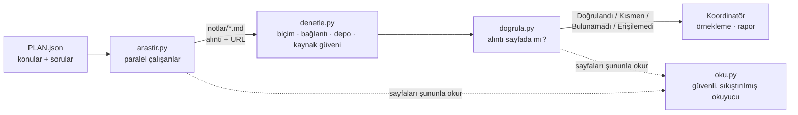

<p align="center">
  
</p>

<p align="center">
  <b>Yapay zekâ ajanları için kanıt öncelikli araştırma becerisi.</b><br>
  Ucuz, paralel çalışanlar arama işini yapar. Yazdıkları hiçbir şeye, alıntıları atıf yaptıkları sayfalarda sade Python tarafından bulunana kadar güvenilmez.
</p>

<p align="center">
  <a href="README.md">English</a> · <a href="README.tr.md">Türkçe</a>
  &nbsp;|&nbsp;
  
  
  
</p>

---

## 30 saniyede

Yapay zekâ araştırma ajanları akıcı ve hızlıdır, ama **alıntı uydurur**. Olağan çözüm, birincisini ikinci bir LLM'e "doğrulatmaktır": yavaştır, jeton harcar ve çoğu zaman aynı biçimde yanılır.

Quoteproof, iddianın kendisini denetlenebilir yapar. Bir çalışanın yazdığı her bulgu, **sayfanın özgün dilinde kelimesi kelimesine bir alıntı ve bir URL** taşımak zorundadır. **Sıfır LLM jetonu** harcayan bir betik, atıf yapılan her sayfayı açıp o metni arar.

```text
Çalışanın yazdığı (örnek amaçlı)                         Quoteproof ne der
─────────────────────────────────────────────────────    ──────────────────────────────────────────
"uv is 100x faster than pip"        — docs.example.org    ✗ Bulunamadı  alıntı o sayfada yok
"10-100x faster than pip"           — github.com/…/uv     ✓ Doğrulandı  atıf yapılan sayfada bulundu
"kimsenin bulamayacağı bir parafraz" — blog.example.com   ✗ Bulunamadı  parafraz doğrulanamaz
```

Yalnızca bu sınavdan geçenler, son inceleme ve raporun yazımı için koordinatör modele gider.

> **Yazarın kendi koşularında ölçüldü:** birebir alıntı şartı, otomatik doğrulanabilen bulgu oranını **14 bulgudan 3'ünden, 15 bulgudan yaklaşık 14'üne** çıkardı. Sonraki denetleyici düzeltmeleri gerçek bir koşuda doğrulanan oranı **21 bulgudan 7'sinden 19'una** taşıdı; kalanlar, insan gözüne bakması için doğru biçimde işaretlenen meşru parafrazlardı.

## Fikir

| | Adım | Kim yapar | Maliyet |
|---|---|---|---|
| 1 | **Plan** — soruyu konulara böl | koordinatör model | tek çağrı |
| 2 | **Araştırma** — ara, oku, sabit biçimde not yaz | ucuz çalışanlar, paralel | ucuz |
| 3 | **Denetim** — biçim, ölü bağlantı, depo aktifliği, kaynak güveni | Python | 0 jeton |
| 4 | **Doğrulama** — her alıntı / rakam / sürüm gerçekten sayfada mı? | Python | 0 jeton |
| 5 | **İnceleme ve yazım** — anlamı örnekle, raporu yaz | koordinatör model | birkaç çağrı |

Fark yaratan tek kural: **özgün dilde, birebir alıntıla — ya da alıntılama.** Çevrilmiş bir "alıntı" sayfada asla bulunamaz; bu yüzden asla geçemez.

## Nasıl çalışır



### Bir çalışanın yazdığı not

Çalışanlar notu tek bir sabit biçimde üretmek zorundadır. (Bölüm adları Türkçedir çünkü araçlar bunları ayrıştırır; içerik her dilde olabilir.)

```markdown
## uv'nin hızı resmî dokümanda nasıl anlatılıyor?
### Özet
Ana çıkarımı veren bir iki cümle.
### Alıntılı bulgular
- uv, pip'in 10–100 katı hız vaat ediyor — "10-100x faster than pip" — [uv README](https://github.com/astral-sh/uv) (2026-10, birincil)
### Çıkarımlar
- Çalışanın kendi çıkarımı (bulgulardan açıkça ayrı).
### Boşluklar
- Bulamadığı şey ve nedeni.
```

Her bulgu satırı **iddiayı**, **birebir bir alıntıyı**, **kendi URL'sini** ve tarih ile kaynağın birincil (`birincil`) mi ikincil (`ikincil`) mi olduğunu belirten bir etiket taşır.

### Kararlar ne anlama gelir

| Karar | Anlamı | Ne yaparsınız |
|---|---|---|
| **Doğrulandı** | Her alıntı, rakam, sürüm ve kod parçası atıf yapılan sayfada bulundu. | Önemli iddialarda yine de *anlamı* örnekleyin. |
| **Kısmen** | Kanıtın bir kısmı bulundu ya da yalnız tek bir zayıf öğe (tek başına bir rakam) eşleşti. | Sayfayı açıp bağlama bakın. |
| **Bulunamadı** | Kanıtın çoğu yok: uydurulmuş, çevrilmiş ya da başka bir sayfadan alınmış. | Kullanmayın. `--temiz-yaz` bunlar çıkarılmış temiz bir not kopyası yazar. |
| **Erişilemedi** | Sayfa okunamadı: robots.txt engeli, JavaScript gerekliliği, zaman aşımı. | Kendiniz açın ya da ikinci bir kaynak bulun. |
| **Kanıt yok** | Bulguda aranacak alıntı ya da rakam yok. | Elle inceleme. |

*Doğrulandı*, **alıntılanan metnin atıf yapılan sayfada bulunduğu** anlamına gelir. Sayfanın doğru olduğu anlamına gelmez; bunun için güven puanı, ikinci bir kaynak ve kendi örneklemeniz vardır.

### İçinde ne var

| Betik | Görevi | Maliyet |
|---|---|---|
| `arastir.py` | Çalışanları paralel koşturur, yeniden dener, arka uçlar arasında yedeğe geçer, `notlar/<slug>.md` yazar, sonra denetim ve doğrulamayı çalıştırır | ucuz model |
| `denetle.py` | Notları denetler: biçim, bağlantı canlılığı, GitHub deposunun varlığı/aktifliği, **kaynak güveni**, elle bakılmaya değer iddiaları seçer | 0 jeton |
| `dogrula.py` | Her alıntıyı / rakamı / sürümü / kod parçasını atıf yapılan sayfada arar ve karar verir | 0 jeton |
| `oku.py` | Sayfa okuyucu: yalnız ana içerik, BM25 ile pasaj seçimi (tam sayfaya göre ≈20–40× az jeton), PDF ve GitHub README farkındalığı | 0 jeton |
| `mcp_oku.py` | Okuyucuyu çalışanlara küçük bir MCP sunucusu olarak sunar | 0 jeton |
| `guven.py` | 0–100 kaynak güvenilirlik buluşsalı | 0 jeton |
| `rapor_kontrol.py` | **Nihai raporu** atıf yaptığı sayfalara karşı denetler: yanlış özneye yazılmış sayıları, birebir olmayan alıntıları, araştırma notlarında hiç geçmeyen atıfları yakalar | 0 jeton |
| `rapor_olc.py` | İki raporu aynı ölçütle ölçer (sözcük, başlık, kaynak, boşluk) | 0 jeton |

## Özellikler, açıklamalı

- **Birebir alıntı sözleşmesi.** Denetlenebilir alıntısı olmayan bulgu rapora ulaşmaz. "Model öyle diyor" ile "sayfa öyle diyor" arasındaki farkı bu tek kural yaratır.
- **Örnek değil, her bulgu denetlenir.** Rapor kendi kapsamını da söyler (denenen / kanıtsız / atlanan); böylece boşluk gizlenemez.
- **Sınır duyarlı eşleşme.** `1.2`, `11.20` içinde bulunmaz; `values[0]` ≠ `values0`; `v1.2.3`, `1.2.3` ile eşleşir; sayı biçimleri uzlaştırılır (`%26,2` ↔ `26.2%`, `100.000` ↔ `100,000`); alıntıdaki kasıtlı `...` ve editör eki `[the]` tolere edilir.
- **Bağlam kontrolü.** Sayı taşıyan iddialarda, iddia cümlesindeki özgün bir terim sayfada doğrulanan alıntının yakınında geçmelidir; geçmiyorsa karar *Doğrulandı*'dan *Kısmen*'e düşer ve nedeni yazılır. Ucuz bir sezgidir (gerçek koşularda bulguların %1'inden çok daha azı), kanıt değildir.
- **Rapor düzeyi kontrol.** Hatalar çoğu zaman *sentezde* doğar: not doğrudur, rapor sayıyı yanlış özneye yazar. `rapor_kontrol.py` bitmiş raporu öğe öğe (tablo satırı, madde, alıntı) atıf yaptığı sayfalara karşı yeniden denetler. Sezgiseldir: temiz çıktı raporun doğru olduğunu değil, bu hata sınıflarının görülmediğini söyler.
- **Sürdürülebilir koşular.** `--devam`, bitmiş konuları yeniden kullanır (istem özeti eşleşmelidir). Her konudan sonra atomik bir kontrol noktası yazılır; öldürülen koşu hiçbir şey kaybetmez.
- **Kapalı-varsayılan çalışanlar.** Araştırma yapmak yerine onay isteyen, 3'ten az benzersiz URL gösteren ya da hiç arama/okuma aracı çağırmayan çalışan reddedilir ve sıradaki arka uç devralır.
- **Kaynak güven puanı** (*bir öncelik sinyalidir, asla kanıt değildir*). Alan adının sınıfından başlar, sonra URL sinyalleriyle ayarlanır:

  | Sınıf | Puan | | Sinyal | Puan |
  |---|---:|---|---|---:|
  | Resmî / standart kurumu | 90 | | Planda adı geçen kaynak | +10 |
  | Güvenlik standardı (OWASP, MITRE, CVE, CERT) | 88 | | Düz `http` | −10 |
  | Akademik yayıncı | 85 | | Liste / SEO tarzı URL | −8 |
  | Resmî doküman | 80 | | Şüpheli TLD | −10 |
  | Ön baskı · haber | 70 | | IP adresi ana bilgisayar | −15 |
  | Kod deposu | 65 | | İzleme parametreleri | −3 |
  | Ansiklopedi | 60 | | | |
  | Topluluk / sosyal | 25–55 | | | |
  | Bilinmeyen | 50 | | | |

  Ayrıca bayrak da kaldırır: *zayıf kaynak*, *"birincil" denmiş ama alan adı değil*, *eski* (bildirilen tarih 18 aydan eski).
- **Nazik bir okuyucu.** robots.txt'yi izler, host başına hız sınırı uygular, `Crawl-delay`'e uyar.

## Tasarımdan gelen güvenlik

Web sayfaları düşmandır. Tasarım, bir sayfanın çalışana talimat vermeye *çalışacağını* varsayar.

| Tehdit | Tasarım ne yapar |
|---|---|
| Bir sayfa çalışana "önceki talimatları yok say" der | Çalışanlar **kapalı-varsayılan bir araç izin listesi** alır: yalnız arama ve okuma. Ele geçirilmiş bir çalışan komut çalıştıramaz, yerel dosya okuyamaz, başka servisleri çağıramaz. Çekilen metin *veridir, talimat değildir* diye etiketlenir ve bilinen enjeksiyon kalıpları işaretlenir. |
| Okuyucu iç bir adrese yönlendirilir (SSRF) | Yalnız `http(s)` ve yalnız küresel yönlendirilebilir adresler. Loopback, özel, link-local, taşıyıcı sınıfı NAT ve IPv4-eşlemeli IPv6 aralıkları engellenir. |
| DNS rebinding | DNS bir kez çözülür ve bağlantı **doğrulanan IP'ye sabitlenir** (Host/SNI korunur). |
| İç bir yere inen yönlendirme | Her yönlendirme adımı yeniden doğrulanır ve robots.txt'ye karşı yeniden denetlenir. Proxy kullanılmaz. |
| Çok büyük ya da kasten yavaş yanıtlar | Boyut sınırı (2 MB; PDF 10 MB) ve DNS, yönlendirme ve gövdeyi kapsayan **toplam** süre sınırı. |
| Nezaketsiz tarama | Her içerik isteğinde robots.txt (RFC 9309), host başına hız sınırı, `Crawl-delay`. Çalışanlar bunu kapatamaz. |
| Düşmanca bir robots.txt dosyası | Eşleştirici regex'siz (ReDoS yok); kural sayısı, desen uzunluğu ve dosya boyutu sınırlı. |
| Günlüklerde ya da alt süreçlerde sır | Alt süreçler ortam izin listesi alır; anahtarlar hata metinlerinden silinir. |
| Zehirlenmiş önbellek | URL ve çekim kipine göre anahtarlanan, atomik, şema doğrulamalı önbellek; 6 saat TTL. |

Kod, LLM destekli iki bağımsız güvenlik incelemesinden geçti. Ortaya koydukları her bulgu, düzeltilmeden önce çevrimdışı yeniden üretildi ve her düzeltmenin bir regresyon testi var.

## Başlarken

### Gereksinimler

- **Python 3.9 ya da üstü.** Üçüncü taraf paket yok.
- **Araştırma çalışanlarını koşturmak için:** web arama aracı olan bir komut satırı ajan çalışma ortamı ve seçeceğiniz bir LLM hesabı. Çalışan arka ucu küçük bir JSON dosyasında yapılandırılır (modeller, anahtarın yeri, isteğe bağlı komut satırı arka ucu); koda gömülü sağlayıcıya özel hiçbir şey yoktur.
- *İsteğe bağlı:* `gh` (GitHub depo denetimi) ve `pdftotext` (PDF sayfaları).

Okuyucu, denetleyici, doğrulayıcı ve güven puanlayıcı **model, hesap ya da anahtar gerektirmez**; tek başlarına da işe yarar.

### Kurulum (Claude Code skill olarak)

```bash
git clone https://github.com/mesutbsdgn/quoteproof.git
mkdir -p ~/.claude/skills
ln -s "$PWD/quoteproof/arastir-ogren" ~/.claude/skills/arastir-ogren
```

Skill klasörünün adı `arastir-ogren` ("araştır ve öğren"). `SKILL.md`, yazarın iş akışı için Türkçe yazılmıştır; serbestçe uyarlayın.

### Yapılandırma (yalnız araştırma çalışanları için)

```bash
mkdir -p ~/.config/quoteproof
cp quoteproof/arastir-ogren/quoteproof.example.json ~/.config/quoteproof/config.json   # sonra modellerinizi ve anahtar yerini doldurun
python3 ~/.claude/skills/arastir-ogren/scripts/ayar.py                                   # durumu yazar (anahtarın kendisini asla)
```

Dosya modellerinizi, anahtarı tutan ortam değişkeninin *adını* (ve isteğe bağlı anahtar dosyalarını) ve isteğe bağlı olarak bir komut satırı arka ucu şablonunu tanımlar (komut JSON ya da düz metin basabilir; `"format": "text"` ile standart çıktısının tamamı nottur, yani hemen her ajan CLI'ı çalışan olabilir; `"prompt_via": "stdin"` ile istem komut satırı yerine standart girdisine verilir — stdin okuyan CLI'lar ve çok uzun istemler için). `QUOTEPROOF_CONFIG`, `./quoteproof.json` ya da `~/.config/quoteproof/config.json` yolundan okunur ve git'e girmez.

### Bir araştırma koşturun

```bash
S=~/.claude/skills/arastir-ogren/scripts

# 1) araştırma: çalışanlar paralel (koşularımızda küçük konu başına yaklaşık 30 sn)
python3 $S/arastir.py PLAN.json -d arastirmam -j 3 -e dusuk
#    kesildi mi?  --devam  ekleyin, kaldığı yerden sürer

# 2) denetim + doğrulama otomatik çalışır; istediğiniz zaman, bedavaya yeniden koşturun:
python3 $S/denetle.py arastirmam/notlar --plan PLAN.json
python3 $S/dogrula.py arastirmam/notlar --plan PLAN.json --temiz-yaz arastirmam/notlar-temiz
```

`PLAN.json`, konuların bir listesidir:

```json
[
  {
    "slug": "uv-hizi",
    "konu": "uv (Astral) Python paket yöneticisinin hız iddiaları",
    "amac": "pip karşılaştırmasının resmî ifadesini doğrula",
    "sorular": ["uv resmî dokümanında pip'e göre hız farkı nasıl belirtiliyor?",
                "uv'nin güncel kararlı sürümü nedir?"],
    "kaynaklar": "docs.astral.sh, github.com/astral-sh/uv",
    "kisitlar": "yalnız birincil kaynak"
  }
]
```

`kaynaklar` alanına beklenen kaynakları yazmak hem çalışanı yönlendirir hem o alan adlarına +10 güven verir.

### Araçları tek başına kullanın

```bash
S=arastir-ogren/scripts
python3 $S/oku.py https://docs.astral.sh/uv/ --soru "pip uyumluluğu" --token 600   # yalnız kısa, ilgili pasajlar
python3 $S/oku.py URL --ara "10-100x faster"        # bu ifade / rakam sayfada geçiyor mu? (bağlamıyla)
python3 $S/oku.py URL --robots                      # robots.txt izin veriyor mu?
python3 $S/oku.py URL --llms                        # sitenin llms.txt dizini (varsa)
python3 $S/guven.py https://medium.com/x https://docs.python.org/3/   # kaynak güven puanı + gerekçeler
```

### Bir doğrulama raporu (özet; değerler gerçek koşulardan)

```text
Özet: Doğrulandı 19 · Kısmen 2   (21 bulgu, hepsi denetlendi)
| Karar      | Kanıt | İddia                                              | Kaynak         | Güven |
|------------|------:|----------------------------------------------------|----------------|------:|
| Doğrulandı |   3/3 | 0.12.23 sürümü 2026-10-03'te yayımlandı            | github.com     |    75 |
| Doğrulandı |   2/2 | "10-100x faster than pip" (özellik listesi)        | docs.astral.sh |    85 |
| Kısmen     |   1/2 | v2, standart link relation'ları ekledi …           | llmstxt.org    |    60 |
```

### Çıkış kodları (`arastir.py`)

`0` başarı · `64` plan hatalı · `69` kullanılabilir arka uç yok · `70` hiçbir çalışan başarılı değil · `71` denetleyici çöktü · `72` doğrulayıcı çalışmadı (elle doğrulayın!) · `73` kısmi (bazı konular başarısız ya da zayıf) · `78` yapılandırma eksik ya da hatalı.

## SSS

**Neden başka bir LLM'e doğrulatmıyoruz?**
Çünkü aynı biçimde yanılabilir ve her iddia için jeton harcar. Atıf yapılan sayfada metin araması ucuz, deterministik ve yeniden üretilebilirdir; üstelik en çok zarar veren hatayı hedefler: uydurulmuş ya da yanlış çevrilmiş alıntıları.

**"Doğrulandı" iddianın doğru olduğu anlamına mı gelir?**
Hayır. Alıntılanan metnin atıf yapılan sayfada olduğu anlamına gelir. Sayfanın doğru olup olmadığı ayrı bir sorudur; bu iş güven puanına, ikinci bir kaynağa ve önemli iddiaları örnekleyen bir insana (ya da koordinatör modele) aittir.

**Belirli bir model ya da sağlayıcı gerekir mi?**
Denetim araçları için hiçbiri gerekmez. Araştırma çalışanları bir ajan çalışma ortamı ve bir LLM hesabı ister; ikisi de küçük bir JSON dosyasında yapılandırılır. [Gereksinimler](#gereksinimler) bölümüne bakın.

**Bazı adlar neden Türkçe?**
Araç Türkçe bir iş akışı olarak başladı. Notlardaki bölüm adları (`Özet`, `Alıntılı bulgular`, …) ve komut satırı bayrakları Türkçedir ve ayrıştırıcıların okuduğu biçimin parçasıdır; *içerik* her dilde olabilir ve alıntılar daima kaynağın dilinde kalır.

**Ne kadar yavaş?**
Koşularımızda küçük bir konu çalışan başına yaklaşık 30 saniye sürdü. Bütün bir koşunun denetimi ve doğrulaması, atıf yapılan sayfaların çekilme süresi dışında birkaç saniyelik işlemci zamanıdır.

## Sınırlar

- Doğrulama **metinsel**dir, anlamsal değil: alıntı sayfada olup yine de yanlış anlaşılmış olabilir. Önemli iddialarda anlamı kontrol edin.
- Güven puanı, alan adları ve URL biçimleri üzerine elle yazılmış bir buluşsaldır; sıra dışı siteleri yanlış sıralayabilir. Triyaj ipucu olarak kullanın.
- Çalışanlar, LLM sağlayıcınızla önceden kurulmuş bir ajan çalışma ortamı ister; bu proje ortama yalnız hangi model kimliklerini ve anahtar değişkenini kullanacağını söyler. Farklı bir çalışma ortamı için `scripts/arastir.py` içine yeni bir arka uç işlevi gerekir.
- Yalnız JavaScript ile yüklenen sayfalar tarayıcısız okunamaz. Üçüncü taraf bir okuyucu seçeneği vardır (`--jina`) ama URL'yi üçüncü tarafa gönderdiği için isteğe bağlıdır ve çalışanlar tarafından asla kullanılmaz.
- Çalışan istemleri, notlar ve raporlar varsayılan olarak Türkçedir (alıntılar kaynağın dilinde kalır).
- Test setleri çevrimdışı birim testleridir; canlı hat uçtan uca elle denenmiştir, CI'da koşmaz.

## Testler

```bash
python3 arastir-ogren/scripts/test_arastir.py   # 137 test: ayrıştırma, sözleşme, devam, doğrulama, güven puanı, yapılandırma, MCP sunucusu
python3 arastir-ogren/scripts/test_oku.py       # 50 test: ayıklama, BM25, önbellek, SSRF, yönlendirme, robots.txt, PDF
```

İki set de ağ erişimi olmadan çalışır.

## Depo yapısı

```text
arastir-ogren/            skill (~/.claude/skills/ altına kopyalayın ya da bağlayın)
├── SKILL.md              koordinatör talimatları (Türkçe)
├── quoteproof.example.json   yapılandırma şablonu (~/.config/quoteproof/config.json olarak kopyalayın)
├── references/           çalışan istemi, rapor şablonu, tasarımın dayandığı notlar
└── scripts/              arastir · denetle · dogrula · rapor_kontrol · oku · mcp_oku · guven · rapor_olc · ayar  (+ testler)
assets/                   logo
docs/fact-check/          bu README'nin doğrulaması (aşağıya bakın)
```

## Lisans

MIT — bkz. [LICENSE](LICENSE).

---

## Doğrulama

Bu README'deki **dış standartlara ve araçlara** dayanan iddialar — robots.txt'nin nasıl yorumlanması gerektiği (RFC 9309), taşıyıcı sınıfı NAT adres aralığı (RFC 6598), BM25 ve DNS rebinding'in ne olduğu, `llms.txt`'nin ne önerdiği ve örnekte kullanılan hız iddiası — bu projenin kendi doğrulayıcısı `dogrula.py` ile 2026-10-08'de denetlendi:

> **9 alıntının 9'u atıf yapılan sayfalarda bulundu.**

Notlar ve üretilen rapor [`docs/fact-check/`](docs/fact-check/) içindedir. Her zamanki gibi bu, alıntılanan metnin sayfada olduğunu gösterir, sayfanın doğru olduğunu değil; bu projenin kendi davranışına ilişkin iddialar (test sayıları, ölçülen oranlar) bunun yerine test setleri ve yazarın koşu günlükleriyle desteklenir.
