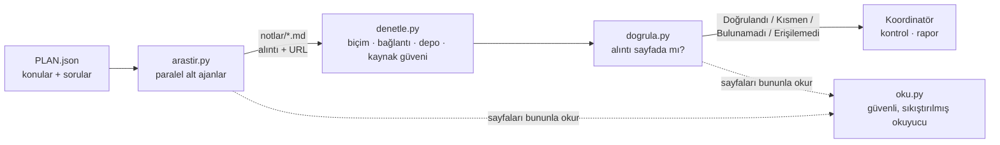

<p align="center">
  
</p>

<p align="center">
  <b>Yapay zekâ ajanlarının uydurduğu alıntıları yakalayan, kanıt öncelikli araştırma hattı.</b><br>
  Aramayı ucuz modeller paralel yürütür. Bir bulguya ancak alıntısı, gösterdiği sayfada kelimesi kelimesine bulunursa güvenilir; bu kontrolü model değil, düz bir Python betiği yapar.
</p>

<p align="center">
  <a href="README.md">English</a> · <a href="README.tr.md">Türkçe</a>
  &nbsp;|&nbsp;
  
  
  
</p>

---

## 30 saniyede

Yapay zekâ araştırma ajanları hızlı ve akıcı yazar, ama **alıntı uydurur**. Alışılmış çözüm, ilk modelin işini ikinci bir LLM'e kontrol ettirmektir. Bu yöntem yavaştır, jeton harcar ve çoğu zaman ilk modelle aynı yerlerde yanılır.

Quoteproof bu kontrolü bir modele bırakmaz, **kaynağın kendisine** bakar. İş üç adımda yürür:

1. **Katı kural:** Aramayı yapan ucuz modeller (belgede *alt ajan* diye anılır) her bulguyu **sayfanın özgün dilinde, kelimesi kelimesine bir alıntı ve bir URL** ile yazmak zorundadır.
2. **Sıfır jetonlu denetim:** **Hiç LLM çağırmayan** bir Python betiği, gösterilen her sayfayı açıp alıntıyı, rakamı ve sürümü arar.
3. **Sentez:** Denetimi geçemeyen bulgular işaretlenir ya da elenir. Geçenler, son incelemeyi yapıp raporu yazan **koordinatör modele** gider.

```text
Alt ajanın yazdığı (örnek amaçlı)                        Quoteproof ne der
─────────────────────────────────────────────────────    ──────────────────────────────────────────
"uv is 100x faster than pip"        — docs.example.org    ✗ Bulunamadı  alıntı o sayfada yok
"10-100x faster than pip"           — github.com/…/uv     ✓ Doğrulandı  gösterilen sayfada bulundu
"kimsenin bulamayacağı bir parafraz" — blog.example.com   ✗ Bulunamadı  parafraz doğrulanamaz
```

> **Yazarın kendi denemelerinde ölçüldü:** Birebir alıntı şartıyla, otomatik doğrulanabilen bulgu oranı yaklaşık **%21'den (14 bulguda 3) %93'e (15 bulguda 14)** çıktı. Denetleyicide sonradan yapılan düzeltmelerle, gerçek bir çalıştırmada 21 bulgudan doğrulananların sayısı **7'den 19'a** yükseldi. Geri kalanlar, bir insanın bakması gerektiği için doğru biçimde işaretlenen meşru parafrazlardı.

## Fikir

| | Adım | Kim yapar | Maliyet |
|---|---|---|---|
| 1 | **Plan**: soruyu konulara böl | koordinatör model | tek çağrı |
| 2 | **Araştırma**: ara, oku, notu sabit biçimde yaz | ucuz alt ajanlar, paralel | ucuz |
| 3 | **Denetim**: biçim, ölü bağlantı, depo etkinliği, kaynak güveni | Python | 0 jeton |
| 4 | **Doğrulama**: her alıntı, rakam ve sürüm gerçekten sayfada mı? | Python | 0 jeton |
| 5 | **İnceleme ve yazım**: anlamı kontrol et, raporu yaz | koordinatör model | birkaç çağrı |

Farkı yaratan tek kural şu: **özgün dilde, birebir alıntıla; yapamıyorsan alıntılama.** Çevrilmiş bir "alıntı" sayfada hiçbir zaman bulunamaz, dolayısıyla denetimi de geçemez.

## Nasıl çalışır



### Bir alt ajanın yazdığı not

Alt ajanlar notu tek bir sabit biçimde yazmak zorundadır. Bölüm adları, araçlar bunları ayrıştırdığı için Türkçedir; içerik herhangi bir dilde olabilir.

```markdown
## uv'nin hızı resmî dokümanda nasıl anlatılıyor?
### Özet
Ana çıkarımı veren bir iki cümle.
### Alıntılı bulgular
- uv, pip'in 10–100 katı hız vaat ediyor — "10-100x faster than pip" — [uv README](https://github.com/astral-sh/uv) (2026-10, birincil)
### Çıkarımlar
- Alt ajanın kendi çıkarımı (bulgulardan açıkça ayrı).
### Boşluklar
- Bulamadığı şey ve nedeni.
```

Her bulgu satırında dört öğe bulunur: **iddia**, **birebir alıntı**, **bulgunun kendi URL'si** ve tarihle birlikte kaynağın birincil (`birincil`) mi ikincil (`ikincil`) mi olduğunu gösteren bir etiket.

### Kararlar ne anlama gelir

| Karar | Anlamı | Ne yapmalı |
|---|---|---|
| **Doğrulandı** | Her alıntı, rakam, sürüm ve kod parçası gösterilen sayfada bulundu. | Önemli iddialarda *anlamı* yine de kendiniz kontrol edin. |
| **Kısmen** | Kanıtın bir kısmı bulundu, yalnızca tek bir zayıf öğe (tek başına bir rakam) eşleşti ya da alıntının sözcükleri sayfada birebir var ve yalnız noktalama farklı. | Sayfayı açıp bağlama bakın. |
| **Bulunamadı** | Kanıtın çoğu bulunamadı: alıntı uydurulmuş, çevrilmiş, kısaltılmış ya da başka bir sayfadan alınmış olabilir. Varsa sayfadaki en yakın geçiş gösterilir. | Kullanmayın. `--temiz-yaz`, bunlar çıkarılmış temiz bir not kopyası yazar. |
| **Erişilemedi** | Sayfa okunamadı: robots.txt engeli, JavaScript gerekliliği, zaman aşımı. | Kendiniz açın ya da ikinci bir kaynak bulun. |
| **Kanıt yok** | Bulguda aranacak alıntı ya da rakam yok. | Elle inceleyin. |

*Doğrulandı*, **alıntılanan metnin gösterilen sayfada bulunduğu** anlamına gelir; sayfanın doğru olduğunu göstermez. Bunun için güven puanına, ikinci bir kaynağa ve kendi kontrolünüze başvurun.

### İçinde ne var

| Betik | Görevi | Maliyet |
|---|---|---|
| `arastir.py` | Alt ajanları paralel çalıştırır, başarısız olanı yeniden dener, gerekirse başka arka uca geçer, `notlar/<slug>.md` dosyalarını yazar, ardından denetim ve doğrulamayı çalıştırır | ucuz model |
| `denetle.py` | Notları denetler: biçim, bağlantının çalışıp çalışmadığı, GitHub deposunun var olup olmadığı ve etkinliği, **kaynak güveni**. Elle bakılmaya değer iddiaları seçer | 0 jeton |
| `dogrula.py` | Her alıntıyı, rakamı, sürümü ve kod parçasını gösterilen sayfada arar, karar verir | 0 jeton |
| `oku.py` | Sayfa okuyucu: yalnızca ana içeriği alır, BM25 ile pasaj seçer (tam sayfaya göre yaklaşık 20–40 kat az jeton), PDF ve GitHub README dosyalarını tanır | 0 jeton |
| `mcp_oku.py` | Okuyucuyu alt ajanlara küçük bir MCP sunucusu olarak sunar | 0 jeton |
| `guven.py` | 0–100 arası sezgisel kaynak güvenilirlik puanı | 0 jeton |
| `rapor_kontrol.py` | **Son raporu**, kaynak gösterdiği sayfalarla karşılaştırır: yanlış özneye bağlanmış sayıları, birebir olmayan alıntıları ve araştırma notlarında hiç geçmeyen kaynakları yakalar | 0 jeton |
| `kapsama.py` | Planda listelenen beklenen anahtar olguları (`olgular`) doğrulanmış bulgularla karşılaştırır: "kapsama 9/12, eksik: …"; yalnız eksik olguları soran bir ek plan yazar | 0 jeton |
| `destek.py` | Her notun **Özet ve Çıkarımlar cümlelerini** denetler: içlerindeki her somut öğe (sayı, tarih, `X25519` ya da `PEP 703` gibi tanımlayıcı, kısaltma) notun kendi alıntılarında ya da atıf yaptığı sayfalarda geçmeli; yalnız sayfada, yalnız başka sorunun sayfasında ya da hiçbir yerde olanları bildirir | 0 jeton |
| `hakem.py` | **İsteğe bağlı, deneysel.** Alıntılarda geçen bir sayının cümlenin konusuna ait olup olmadığını küçük bir modele sorar; varsayılan kapalı, çağrı sınırlı, `judge_backend` ister | model jetonu |
| `uzlas.py` | Aynı konunun birkaç bağımsız çalıştırmasının doğrulanmış notlarını birleştirir: hangi iddia kaç çalıştırmada bulundu, yalnız tek çalıştırmanın bulduğu ne, ve bulguları `[k/N çalıştırma]` taşıyan birleşik not | 0 jeton |
| `rapor_olc.py` | İki raporu aynı ölçütlerle ölçer (sözcük, başlık, kaynak, boşluk) | 0 jeton |

## Özellikler

- **Birebir alıntı sözleşmesi.** Denetlenebilir alıntısı olmayan bulgu rapora giremez. "Model öyle diyor" ile "sayfa öyle diyor" arasındaki farkı bu tek kural yaratır.
- **Örnekleme yok, her bulgu denetlenir.** Rapor kendi kapsamını da bildirir (denenen, kanıtsız, atlanan); böylece boşluk gizlenemez.
- **Sınırları gözeten eşleşme.** `1.2`, `11.20` içinde aranırken bulunmaz; `values[0]` ile `values0` farklıdır; `v1.2.3`, `1.2.3` ile eşleşir. Sayı biçimleri uzlaştırılır (`%26,2` ↔ `26.2%`, `100.000` ↔ `100,000`). Alıntıdaki kasıtlı `...` ve editör eki `[the]` eşleşmeyi bozmaz.
- **Bağlam kontrolü.** Sayı içeren iddialarda, iddia cümlesindeki ayırt edici bir terim, sayfada doğrulanan alıntının yakınında da geçmelidir. Geçmezse karar *Doğrulandı*'dan *Kısmen*'e düşer ve nedeni yazılır. Bu ucuz bir sezgidir (gerçek çalıştırmalarda bulguların %1'inin çok altında), kanıt değildir.
- **Rapor düzeyinde kontrol.** Hatalar çoğunlukla *sentez* aşamasında doğar: not doğrudur, ama rapor sayıyı yanlış özneye bağlar. `rapor_kontrol.py`, bitmiş raporu öğe öğe (tablo satırı, madde, alıntı) kaynak gösterdiği sayfalarla yeniden karşılaştırır. Sezgiseldir: temiz çıktı raporun doğru olduğunu değil, bu hata türlerinin görülmediğini söyler.
- **Kaldığı yerden sürdürülebilen çalıştırmalar.** `--devam`, bitmiş konuları yeniden kullanır (istemin özet değeri aynı olmalıdır). Her konudan sonra tek adımda (atomik) bir kontrol noktası yazılır; çalıştırma yarıda kesilse bile kayıp olmaz.
- **Güvenli tarafta kalan alt ajanlar.** Araştırma yapmak yerine onay isteyen, 3'ten az benzersiz URL gösteren ya da hiç arama veya okuma aracı çağırmayan alt ajan reddedilir; sıradaki arka uç işi devralır.
- **Kaynak güven puanı** (*öncelik belirlemeye yarar, asla kanıt değildir*). Alan adının sınıfından başlar, sonra URL sinyalleriyle ayarlanır:

  | Sınıf | Puan | | Sinyal | Puan |
  |---|---:|---|---|---:|
  | Resmî / standart kurumu | 90 | | Planda adı geçen kaynak | +10 |
  | Güvenlik standardı (OWASP, MITRE, CVE, CERT) | 88 | | Düz `http` | −10 |
  | Akademik yayıncı | 85 | | Liste / SEO tarzı URL | −8 |
  | Resmî doküman | 80 | | Şüpheli TLD | −10 |
  | Ön baskı · haber | 70 | | IP adresli ana makine | −15 |
  | Kod deposu | 65 | | İzleme parametreleri | −3 |
  | Ansiklopedi | 60 | | | |
  | Topluluk / sosyal | 25–55 | | | |
  | Bilinmeyen | 50 | | | |

  Ayrıca şu uyarıları verir: *zayıf kaynak*, *"birincil" denmiş ama alan adı birincil değil*, *eski* (bildirilen tarih 18 aydan eski).
- **Saygılı okuyucu.** robots.txt kurallarına uyar, host başına hız sınırı uygular, `Crawl-delay` değerine uyar.

## Tasarım gereği güvenlik

Web sayfalarına düşmanca girdi gözüyle bakılır. Tasarım, bir sayfanın alt ajana talimat vermeye *çalışacağını* baştan kabul eder.

| Tehdit | Tasarım ne yapar |
|---|---|
| Bir sayfa alt ajana "önceki talimatları yok say" der | OpenCode alt ajanlarına, **varsayılanı "yasak" olan bir araç izin listesi** verilir: yalnızca arama ve okuma. Ele geçirilmiş bir alt ajan komut çalıştıramaz, yerel dosya okuyamaz, başka servisleri çağıramaz. Çekilen metin *veridir, talimat değildir* diye etiketlenir ve bilinen enjeksiyon kalıpları işaretlenir. |
| Okuyucu iç bir adrese yönlendirilir (SSRF) | Yalnızca `http(s)` ve yalnızca genel ağda yönlendirilebilen adresler kabul edilir. Loopback, özel, link-local, operatör tipi NAT (CGNAT) ve IPv4 eşlemeli IPv6 aralıkları engellenir. |
| DNS rebinding | DNS bir kez çözülür ve bağlantı **doğrulanan IP'ye sabitlenir** (Host/SNI korunur). |
| İç ağa çıkan yönlendirme | Her yönlendirme adımı yeniden doğrulanır ve robots.txt'ye karşı yeniden denetlenir. Proxy kullanılmaz. |
| Çok büyük ya da kasten yavaş yanıtlar | Boyut sınırı (2 MB; PDF için 10 MB) ve DNS, yönlendirme ve gövdeyi kapsayan **toplam** süre sınırı. |
| Saygısız tarama | Her içerik isteğinde robots.txt (RFC 9309), host başına hız sınırı ve `Crawl-delay` uygulanır. Alt ajanlar bunu kapatamaz. |
| Kötü niyetli bir robots.txt dosyası | Eşleştirici regex kullanmaz (ReDoS yok); kural sayısı, desen uzunluğu ve dosya boyutu sınırlıdır. |
| Günlüklere ya da alt süreçlere sızan sırlar | OpenCode ve MCP alt süreçlerine yalnızca izin verilen ortam değişkenleri (ve yapılandırılmış anahtar) geçer; hata metinlerindeki bazı anahtar benzeri değerler maskelenir. Kapsamı dardır, bkz. [Sınırlar](#sınırlar). |
| Zehirlenmiş önbellek | Anahtarı URL ve çekim kipinden oluşan, atomik, şema doğrulamalı önbellek; 6 saat TTL. |

Kod, LLM destekli iki bağımsız güvenlik incelemesinden geçti. İncelemelerin bulduğu her sorun, düzeltilmeden önce çevrimdışı ortamda yeniden üretildi ve her düzeltme için bir regresyon testi yazıldı. Bu tablo yalnızca OpenCode alt ajanları ve okuyucu için geçerlidir; özel CLI arka ucunun sınırları [Sınırlar](#sınırlar) bölümünde anlatılır.

## Başlarken

### Gereksinimler

- **Python 3.9 ya da üstü.** Üçüncü taraf paket yok.
- **Araştırma alt ajanlarını çalıştırmak için:** web arama aracı olan, komut satırından çalışan bir ajan ortamı ve istediğiniz bir LLM hesabı. Alt ajan arka ucu küçük bir JSON dosyasıyla yapılandırılır (modeller, anahtarın yeri, isteğe bağlı komut satırı arka ucu). Koda gömülü, sağlayıcıya özel hiçbir şey yoktur.
- *İsteğe bağlı:* `gh` (GitHub depo denetimi; kimlik doğrulamasını `gh` yönetir) ve `pdftotext` (PDF sayfaları).

Okuyucu, denetleyici, doğrulayıcı ve güven puanlayıcı için **model, hesap ya da anahtar gerekmez**; bunlar tek başlarına da işe yarar.

### Kurulum (Claude Code skill olarak)

```bash
git clone https://github.com/mesutbsdgn/quoteproof.git
mkdir -p ~/.claude/skills
ln -s "$PWD/quoteproof/arastir-ogren" ~/.claude/skills/arastir-ogren
```

Skill klasörünün adı `arastir-ogren` ("araştır ve öğren"). `SKILL.md`, yazarın kendi iş akışı için Türkçe yazılmıştır; dilediğiniz gibi uyarlayabilirsiniz.

### Yapılandırma (yalnız araştırma alt ajanları için)

```bash
mkdir -p ~/.config/quoteproof
cp quoteproof/arastir-ogren/quoteproof.example.json ~/.config/quoteproof/config.json   # sonra modellerinizi ve anahtar yerini doldurun
python3 ~/.claude/skills/arastir-ogren/scripts/ayar.py                                   # durumu yazar (anahtarın kendisini asla)
```

Alt ajan anahtarı OpenCode'a aktarılır; GitHub kimlik doğrulamasını `gh` yönetir (Quoteproof GitHub token'ı tutmaz).

Dosyada şunlar tanımlanır: modelleriniz, anahtarı tutan ortam değişkeninin *adı* (isteğe bağlı olarak anahtar dosyaları) ve isteğe bağlı bir komut satırı arka ucu şablonu.

- Komut JSON ya da düz metin basabilir. `"format": "text"` ayarında standart çıktının tamamı not sayılır; böylece hemen her ajan CLI'ı alt ajan olarak kullanılabilir.
- `"prompt_via": "stdin"` ayarında istem, komut satırı yerine standart girdiden verilir. Bu seçenek, stdin okuyan CLI'lar ve çok uzun istemler için uygundur.
- Özel CLI'a yapılandırılmış anahtar aktarılmaz; CLI yalnızca izin verilen ortam değişkenlerini alır ve kendi oturumunu ya da yapılandırmasını kullanmalıdır. Bu arka uç için güvenlik sınırları [Sınırlar](#sınırlar) bölümündedir.
- Dosya sırasıyla `QUOTEPROOF_CONFIG` ortam değişkeninde, skill klasöründeki `quoteproof.json` dosyasında ve `~/.config/quoteproof/config.json` yolunda aranır. Dosya git'e girmez.

### Hangi kurulum bana yeter?

Quoteproof belli bir sağlayıcıyı ya da bir ajan filosunu varsaymaz. Tek bir model hesabı yeter. Elinizdekine uyan satırı seçin:

| Elinizde olan | Alt ajan arka ucu | Kurulum | Durum |
|---|---|---|---|
| **Yalnız Claude Code** | `claude -p` çalıştıran komut satırı arka ucu | `quoteproof.claude-only.example.json` dosyasını kopyalayın, `claude` ile bir kez giriş yapın; API anahtarı gerekmez | **Uçtan uca denendi** (bir konu, iki soru: 19 bulgunun 18'i doğrulandı, not sözleşmeyi ikinci denemede geçti) |
| **Yalnız GPT/Codex benzeri bir CLI** | o CLI ile komut satırı arka ucu | aynı dosya, `command` değişir; CLI stdin okuyorsa `"format": "text"` ve `"prompt_via": "stdin"` kullanın | Aynı düzenek, **burada denenmedi** |
| **Bir API hesabı** (Alibaba Cloud, OpenAI uyumlu, Ollama ve diğerleri) | çok sağlayıcı destekleyen OpenCode ya da komut satırı arka ucu | `quoteproof.example.json`: `models.*.opencode` = `SAĞLAYICI/MODEL`, anahtar ortam değişkeninde | OpenCode yolu **bir sağlayıcıyla denendi**, diğerleri denenmedi |
| **Hiç model yok** | yok | başka yerde yazılmış herhangi bir yanıt üzerinde `dogrula.py`, `destek.py`, `rapor_kontrol.py` | Denendi; model yok, anahtar yok, 0 jeton |

Bilmeniz gerekenler:
- **Web araması alt ajanın parçasıdır.** Alt ajanın bir arama aracı olmalı. `claude -p` ile bu `WebSearch`/`WebFetch`, OpenCode ile yerleşik arama olur. Arama aracı olmayan bir model (örneğin düz bir Ollama modeli) alt ajan olamaz; yalnız aşağıdaki isteğe bağlı hakem olarak kullanılır.
- **`"format": "text"` aramanın yapıldığını kanıtlayamaz.** Çıktı sözleşmesi yine not yapısını ve en az üç ayrı URL'yi şart koşar, doğrulayıcı da her alıntıyı sayfasında arar; ama bakılacak bir araç günlüğü yoktur.
- **Tek sağlayıcı tam desteklenir.** Varsayılan zincir önce OpenCode'u, sonra komut satırı arka ucunu dener; yalnız biri tanımlıysa yalnız o kullanılır (`python3 scripts/ayar.py` neyin kullanılabildiğini gösterir).

### İsteğe bağlı: birden çok ajan kullanıyorsanız

Tek sağlayıcılı kurulumda bunların hiçbiri gerekmez. Birkaçı varsa şu eklentiler onları kullanır:

- **Çalıştırma başına farklı alt ajan.** `--model AD` yapılandırmanızdaki bir modeli, `--arka opencode|cli` arka ucu seçer. Aynı konuyu iki ayrı modelle koşturup `uzlas.py` ile birleştirmek, tek modeli tekrarlamaktan daha bağımsız bir uzlaşı verir.
- **Yedek zinciri.** `--arka otomatik` (varsayılan) önce OpenCode'u, sonra komut satırı arka ucunu dener.
- **İsteğe bağlı hakem, `hakem.py`.** `destek.py` uydurma sayıyı, belge numarasını ve tarihi bedavaya bulur; ama *doğru* bir sayının *yanlış özneye* bağlandığını göremez. Sözcük örtüşmesine dayalı bir kural denendi ve kaldırıldı (kazanç yok, yanlış alarm). `hakem.py`, riskli her sayı için küçük bir modele tek soru sorar: "bu sayı, bu bulgu satırının anlattığı şeye mi ait?" Yalnız siz çağırınca çalışır, yalnız alıntılarda geçen sayılar için, çağrı sınırıyla; önce kaç çağrı yapılacağını gösteren bir `--kuru` kuru çalıştırması vardır. Yapılandırma dosyasında `judge_backend` altında ayarlanır: alt ajanla aynı komut olabilir (tek sağlayıcı) ya da farklı, daha ucuz bir model. Hakeme araç vermeyin. **Deneysel ve ölçüldüğü kadarıyla zayıf:** kayıtlı notlarda küçük, Claude dışı bir model doğru bağlanmış 87 sayının 4'üne yanlış dedi (yaklaşık %5 yanlış alarm); `destek.py`'nin kaçırdığı 6 enjekte takastan 1'ini işaretledi (anlamsız olanı), 5'ini geçirdi. Geçirdikleri çoğunlukla iki benzer belge numarası arasındaki takaslardı (PEP 779 ile PEP 703); kısa bir cümle bunları ayırt ettirmiyor. `hayır`ı kaynağı açma ipucu sayın, `evet`i asla kanıt saymayın. Varsayılan olarak kapalıdır ve hattın parçası değildir.

### Bir araştırma başlatın

```bash
S=~/.claude/skills/arastir-ogren/scripts

# 1) araştırma: alt ajanlar paralel çalışır (yazarın denemelerinde küçük bir konu için yaklaşık 30 sn)
python3 $S/arastir.py PLAN.json -d arastirmam -j 3 -e dusuk
#    kesildi mi?  --devam  ekleyin, kaldığı yerden sürer

# 2) denetim + doğrulama otomatik çalışır; istediğiniz zaman ücretsiz olarak yeniden çalıştırabilirsiniz:
python3 $S/denetle.py arastirmam/notlar --plan PLAN.json
python3 $S/dogrula.py arastirmam/notlar --plan PLAN.json --temiz-yaz arastirmam/notlar-temiz
```

`PLAN.json`, konuların listesidir:

```json
[
  {
    "slug": "uv-hizi",
    "konu": "uv (Astral) Python paket yöneticisinin hız iddiaları",
    "amac": "pip karşılaştırmasının resmî ifadesini doğrula",
    "sorular": ["uv resmî dokümanında pip'e göre hız farkı nasıl belirtiliyor?",
                "uv'nin güncel kararlı sürümü nedir?"],
    "kaynaklar": "docs.astral.sh, github.com/astral-sh/uv",
    "kisitlar": "yalnız birincil kaynak"
  }
]
```

`kaynaklar` alanına beklediğiniz kaynakları yazarsanız alt ajan doğru yöne yönelir ve bu alan adları +10 güven puanı alır.

İsterseniz `olgular` alanına beklediğiniz anahtar olguları yazın (çalışana hiç gösterilmez; yalnız ölçüm içindir):

```json
"olgular": [
  {"ad": "Konsey PEP'i 16 Haziran 2025'te kabul etti", "ara": "16[- ]?(Jun|June|Haziran)|accepts PEP"},
  {"ad": "uzantı modülleri GIL'i yeniden açabilir", "ara": ["re-enable the GIL", "GIL yeniden"]},
  "tek iş parçacığı cezası yaklaşık %5-10 :: 5-10%"
]
```

`ara`, büyük/küçük harf duyarsız bir düzenli ifadedir (ya da liste; biri yeter). Bir olgu, doğrulanmış "Alıntılı bulgular" satırlarından birinde eşleşirse kapsanmış sayılır; özet ve boşluklar bölümü hiçbir zaman sayılmaz.

Bilerek dar tutulan bir konuya `"min_url": 3` ekleyebilirsiniz (3 ile 30 arasında bir tam sayı). Bundan az benzersiz URL içeren not zayıf sayılır (çıkış kodu `73`); varsayılan eşik 8'dir.

### Araçları tek başına kullanın

```bash
S=arastir-ogren/scripts
python3 $S/oku.py https://docs.astral.sh/uv/ --soru "pip uyumluluğu" --token 600   # yalnız kısa, ilgili pasajlar
python3 $S/oku.py URL --ara "10-100x faster"        # bu ifade ya da rakam sayfada geçiyor mu? (bağlamıyla birlikte)
python3 $S/oku.py URL --robots                      # robots.txt izin veriyor mu?
python3 $S/oku.py URL --llms                        # sitenin llms.txt dizini (varsa)
python3 $S/guven.py https://medium.com/x https://docs.python.org/3/   # kaynak güven puanı + gerekçeler
```

### Örnek doğrulama raporu (özet; değerler gerçek çalıştırmalardan)

```text
Özet: Doğrulandı 19 · Kısmen 2   (21 bulgu, hepsi denetlendi)
| Karar      | Kanıt | İddia                                              | Kaynak         | Güven |
|------------|------:|----------------------------------------------------|----------------|------:|
| Doğrulandı |   3/3 | 0.12.23 sürümü 2026-10-03'te yayımlandı            | github.com     |    75 |
| Doğrulandı |   2/2 | "10-100x faster than pip" (özellik listesi)        | docs.astral.sh |    85 |
| Kısmen     |   1/2 | v2, standart link relation'ları ekledi …           | llmstxt.org    |    60 |
```

### Çıkış kodları (`arastir.py`)

`0` başarı · `64` plan hatalı · `69` kullanılabilir arka uç yok · `70` hiçbir alt ajan başarılı değil · `71` denetleyici çöktü · `72` doğrulayıcı çalışmadı (elle doğrulayın) · `73` kısmi (bazı konular başarısız ya da zayıf) · `78` yapılandırma eksik ya da hatalı.

## SSS

**Quoteproof neden doğrulamayı başka bir LLM'e yaptırmıyor?**
Çünkü o da aynı hataları yapabilir ve her iddia için jeton harcar. Kaynak sayfada metin aramak ucuzdur, her seferinde aynı sonucu verir ve tekrarlanabilir. Üstelik en çok zarar veren hatayı hedefler: uydurulmuş ya da yanlış çevrilmiş alıntıları.

**"Doğrulandı" iddianın doğru olduğu anlamına mı gelir?**
Hayır. Alıntılanan metnin gösterilen sayfada bulunduğu anlamına gelir. Sayfanın doğru olup olmadığı ayrı bir sorudur; bunu güven puanı, ikinci bir kaynak ve önemli iddiaları kontrol eden bir insan (ya da koordinatör model) değerlendirir.

**Belirli bir model ya da sağlayıcı gerekir mi?**
Denetim araçları için hiçbiri gerekmez. Araştırma alt ajanları için bir ajan ortamı ve bir LLM hesabı gerekir; ikisi de küçük bir JSON dosyasıyla yapılandırılır. [Gereksinimler](#gereksinimler) bölümüne bakın.

**Bazı adlar neden Türkçe?**
Araç, Türkçe bir iş akışı olarak başladı. Notlardaki bölüm adları (`Özet`, `Alıntılı bulgular`, …) ve komut satırı bayrakları Türkçedir; ayrıştırıcılar bu biçimi okur. *İçerik* herhangi bir dilde olabilir, alıntılar da her zaman kaynağın dilinde kalır.

**Skill'siz yazılmış bir yanıtı denetleyebilir miyim?**
Evet, hem de model jetonu harcamadan: `python3 scripts/rapor_kontrol.py yanit.md`. Yanıtın kaynak gösterdiği sayfaları okur (tam `https://…` adresleri, markdown bağlantıları ve şemasız `alan.adı/yol` adresleri). Sayfada bulunmayan tırnaklı alıntıları, sayfada geçmeyen sayıları ve okunabilir hiçbir kaynağı olmayan yanıtları işaretler. Yanıtı denetlenebilir yapmak için isteğe tek bir cümle ekleyin: "Her olgunun yanına tam bir https:// URL'si ekle; mümkünse sayfadan 25 kelimeyi aşmayan, kelimesi kelimesine bir alıntı ver." Düz istem ve bu cümleyle yapılan bir denemede yanıtlar iki görevde de denetlenebilir çıktı (6 ve 8 tırnaklı alıntı, 5 ve 8 adres; denetim sayfada bulunmayan 2 ve 1 alıntı yakaladı), maliyet yaklaşık düz istem kadardı. Cümleyi yok sayan bir model yine "denetlenemedi" sonucu verir. Böyle bir cümle olmadan yazılmış düz bir yanıtta denetim, tırnak içine konmuş iki çeviriyi (gerçekte alıntı değil) yakaladı.

**Sonucun eksiksiz olduğunu nasıl anlarım?**
Beklediğiniz anahtar olguları plana yazın (`olgular`, yukarıya bakın). Çalıştırma bittiğinde hat `kapsama.md` ("kapsama 7/12, eksik: …") ve `eksik-PLAN.json` dosyalarını yazar. İkincisi, aynı konunun yalnız eksik olguları soran ek planıdır (en çok üç soru, fazlası son soruda birleşir; soru sayısı arama bütçesini, dolayısıyla maliyeti belirler). Ek planı başka bir klasöre `--hafif` ile çalıştırın, sonra `python3 scripts/uzlas.py ILK/notlar-temiz EK/notlar-temiz --plan PLAN.json --yaz birlesik/` ile birleştirin; rapor her olguyu ve onu bulan çalıştırmaları gösterir. Bir denemede tek `--hafif` çalıştırma beklenen olguların 12'de 7'sini ve 13'te 7'sini kapsadı; hedefli ek çalıştırma (yaklaşık 81 bin ve 157 bin jeton) birleşik notları 12'de 11'e ve 13'te 12'ye çıkardı, birleşik 33 bulgunun 33'ü doğrulandı. Aynı modelin üç kör tekrarı yaklaşık aynı maliyetle 12'de 9'a ve 13'te 11'e varmıştı. Olgu listelerini önceki çalıştırmaların bulduklarından yazdım; bu yüzden sayılar yöntemin lehine. Önceden yazdığınız bir listede sayfalarda bulunmayan olgular da olur (onlar eksik kalır; bunu bilmek de işe yarar). Birleşik not her iddia için tek temsilci bulgu tuttuğundan bir olgu birleşik notun kendi kapsamasından düşebilir (bir durumda 12'de 10).

**Daha eksiksiz ve daha tutarlı sonucu nasıl alırım?**
Konuyu birden çok kez koşturup birleştirin. Tek bir çalıştırma konunun anahtar olgularının yaklaşık %80'ini buldu ve çalıştırmadan çalıştırmaya çok değişti (beş çalıştırmanın en zayıfı 12 olgudan 8'ini, en iyisi 12'sini buldu). İki konuda iki çalıştırmanın birleşimi yaklaşık %91–92'yi, üç çalıştırmanın birleşimi yaklaşık %95–96'yı kapsadı (olgu listelerini çalıştırmaların bulduklarından elle çıkardım; bu yüzden bunlar bir ölçüt değil, yaklaşık değerlerdir). `--hafif` ile bir çalıştırma düz istem kadar maliyetli olduğundan üç çalıştırma, tam kipte bir çalıştırma kadar tutar. Her çalıştırmayı ayrı bir klasöre alın, sonra `python3 scripts/uzlas.py KOSU1/notlar-temiz KOSU2/notlar-temiz KOSU3/notlar-temiz --cikti uzlasi.md --yaz birlesik/` çalıştırın. Birleşik notlar `dogrula.py`'den yeniden geçer (denemede 35'in 35'i doğrulandı) ve her bulgu `[k/N çalıştırma]` taşır; yalnız tek çalıştırmanın bulduğu iddia "tek başına güvenme" diye listelenir. Mümkünse iki farklı model karıştırın: aynı modelin çalıştırmaları birbirinin boşluğunu tekrarlar. Bir denemede aynı modelin üç tekrarı yine de anahtar olguların 12'de 9'unu ve 13'te 11'ini kapsadı; tekrarlardan birini farklı bir modelle değiştirmek ortalama bir olgu daha ekledi (iki konuda 0,6 ile 1,3 arası; birinde hiç eklemedi). Plana birincil kaynak sayfalarını sabitlemek tutarlılığı güvenilir biçimde değiştirmedi (biraz daha ucuzdu).

**Özet cümlelerini de denetliyor mu, yoksa yalnız alıntıları mı?**
İkisini de denetler ve ikincisi de model jetonu harcamaz. `dogrula.py` her bulgunun alıntısını sınar; `destek.py` (onun ardından kendiliğinden çalışır, `destek.md` yazar) *Özet* ve *Çıkarımlar* cümlelerini alır ve içlerindeki her somut öğeyi arar: sayılar, tarihler (`24 Mart 2026` ↔ `Mar 24, 2026` ↔ `2026-03`), tanımlayıcılar (`X25519`, `ML-KEM-768`, `PEP 703`) ve kısaltmalar. Sorunun kendi alıntılarında geçen öğe sorun değildir, sessiz kalır. Üç durum bildirilir:

- Öğe yalnız kaynak gösterilen sayfada geçiyorsa bu *bilgi* satırıdır: kanıt alıntıya taşınmamış.
- Öğe yalnız başka sorunun sayfasında geçiyorsa *uyarıdır*: yanlış özneye yapışmış olabilir.
- Öğe kaynak gösterilen hiçbir sayfada geçmiyorsa *ciddi uyarıdır*: uydurma, çeviri ya da hesaplanmış değer olabilir.

Temizliğin bıraktığı tipik artığı da yakalar: `dogrula.py`'nin çıkardığı bir bulguya yaslanan özet cümlesi. Araç yalnız somut öğeleri sınar. Bir cümlenin kaynakla aynı anlama geldiğini söyleyemez, temiz sonuç kanıt değildir ve hesaplanmış bir değer (toplam, oran) yanlış alarm verebilir. Çıkış kodunu değiştirmez; ciddi uyarı varsa `destek.py --siki` 1 döndürür. Bu deponun 11 kayıtlı çalıştırmasında çalıştırma başına 0–5 cümleyi işaretledi; ayarlandıktan sonra hepsi bilgi düzeyindeydi ve doğrulanmış bir uydurma iddia bulunmadı. Gösterdiği şey, doğrulayıcının çıkardığı bir bulguya (bir arşiv tarihine) yaslanan bir özet cümlesiydi. İlk ciddi uyarılar yanlış alarmdı: alt ajanın gördüğü bir HTTP durum kodu, yalnız adreste geçen bir kısaltma ve `PEP 387’s` iyelik eki. Üçü de artık ele alınıyor ve birer testle korunuyor. Yakalama gücü, 12 kayıtlı notun 151 özet cümlesine bilinen hata enjekte edilerek ölçüldü (yapay, tek alan, küçük örneklem): uydurma sayı 46 olgudan 38'inde uyarı düzeyinde işaretlendi (kaçanlar tırnak içindeki sayılar, ki bilerek atlanır, ve testin kendi kusuru), uydurma belge numarası ya da tarih 151'in 148'inde, başka sorunun sayısı 16'nın 14'ünde. Doğru sayının yanlış özneye bağlanmasını, iki sayı da sorunun alıntılarında geçiyorsa yakalamaz (14 takasın 6'sı kaçtı; sözcük örtüşmesine dayalı bir özne denetimi denendi ve kaldırıldı: kazanç yok, 16 yanlış alarm); anlamı tersine çevrilmiş cümleyi göremez (151'de 0). Yani uydurma somut öğeyi bulur; anlamı doğrulamaz.

**Maliyeti nedir?**
İki dar konuda (her biri iki soru) küçük, düşük maliyetli bir modelle, ham olay kayıtlarından ölçüldü. Sağlayıcının önbelleğinden okunan girdi, taze girdiden çok daha ucuz fiyatlandığı için ayrı gösterilir.

| Çalıştırma | Taze girdi | Önbellekten girdi | Çıktı + akıl yürütme | Adım | Süre |
|---|---:|---:|---:|---:|---:|
| Düz istem, skill yok (konu 1 / 2) | 16,3 bin / 14,6 bin | 19,5 bin / 6,1 bin | 1,0 bin / 1,7 bin | 3 / 2 | 33 sn / 54 sn |
| Tam kip (konu 1 / 2) | 31,1 bin / 34,4 bin | 71,7 bin / 108,3 bin | 5,0 bin / 7,2 bin | 5 / 6 | 101 sn / 151 sn |
| `--hafif` (konu 1 / 2) | 16,6 bin / 14,8 bin | 22,5 bin / 17,4 bin | 2,8 bin / 2,9 bin | 3 / 3 | 52 sn / 42 sn |

Tam kip pahalıdır, çünkü arama sonuçları (tek arama 12–24 bin karakter döndürür, varsayılan olarak sekiz sonuç) bağlamda kalır ve her adımda yeniden gönderilir; ayrıca bütçesi 10–15 aramadır. `--hafif`, bütçeyi soru sayısına göre ölçekler, aramada en çok dört sonuç ister ve adımı 12 ile sınırlar; alıntı sözleşmesi ve doğrulama aynen kalır. Aynı konularda 22 alıntının 19'u sayfada birebir bulundu; kalan üçü gerçek bozulmaydı (ör. sayfada "Yesterday's" yazarken "Tomorrow's"). Dar konularda (bir ila üç soru) `--hafif`, geniş konularda tam kip kullanın. Doğrulamanın kendisi model jetonu harcamaz. Her hücre tek çalıştırma; sayılar çalıştırmadan çalıştırmaya değişir (aynı tam kip görevi iki çalıştırmada 152 bin ve 103 bin girdi jetonu okudu).

**Ne kadar sürüyor?**
Yazarın denemelerinde küçük bir konu, alt ajan başına yaklaşık 30 saniye sürdü. Bütün bir çalıştırmanın denetimi ve doğrulaması, kaynak sayfaların indirilme süresi hariç birkaç saniyelik işlemci zamanı tutar.

## Sınırlar

- Doğrulama **metinsel**dir, anlamsal değildir: alıntı sayfada bulunup yine de yanlış anlaşılmış olabilir. Önemli iddialarda anlamı kendiniz kontrol edin.
- Güven puanı, alan adları ve URL biçimleri üzerine elle yazılmış bir sezgisel yöntemdir; alışılmadık siteleri yanlış sıralayabilir. Yalnızca öncelik belirlemek için kullanın.
- Alt ajanlar için, LLM sağlayıcınıza bağlanmış hazır bir ajan ortamı gerekir; proje ortama yalnızca hangi model kimliklerini ve anahtar değişkenini kullanacağını bildirir. Farklı bir ortam için `scripts/arastir.py` dosyasına yeni bir arka uç işlevi eklemek gerekir.
- **Güvenlik sınırı özel CLI arka ucunu kapsamaz.** Varsayılanı "yasak" olan araç izinleri yalnızca OpenCode için tanımlıdır. Özel CLI yalnızca izin verilen ortam değişkenleriyle çalıştırılır ve `api_key_env` anahtarı bu yoldan aktarılmaz. Ortam değişkenlerini süzmek, CLI'ın dosya sistemine ya da ağa erişimini kısıtlamaz. Güvenmediğiniz bir CLI'ı kendi izolasyonunuzda (kapsayıcı, ayrı kullanıcı) çalıştırın.
- **Gizli bilgi maskeleme sınırlıdır.** Basit bir kalıpla yalnızca hata metinlerindeki bazı anahtar benzeri değerler maskelenir. Alt ajan çıktısı, özel CLI yolu dahil, olduğu gibi not dosyasına yazılır; genel bir temizleme garantisi yoktur. `denetle.py`, `gh` alt sürecini ana sürecin ortamıyla çalıştırır.
- Yalnızca JavaScript ile yüklenen sayfalar tarayıcı olmadan okunamaz. Üçüncü taraf bir okuyucu seçeneği (`--jina`) vardır, ama URL'yi üçüncü tarafa gönderdiği için isteğe bağlıdır ve alt ajanlar bunu hiçbir zaman kullanmaz.
- Okuyucu proxy kullanmaz ve DNS'i kendisi çözer. Yalnızca proxy üzerinden dışarı çıkılabilen ortamlarda çevrimiçi okuma ve alıntı doğrulama çalışmaz; çevrimdışı birim testleri etkilenmez.
- Alt ajan istemleri, notlar ve raporlar varsayılan olarak Türkçedir (alıntılar kaynağın dilinde kalır).
- Test setleri çevrimdışı birim testleridir; canlı hat uçtan uca elle denendi, CI'da çalışmaz.
- **Canlı araştırmanın güvenilirliği henüz kanıtlanmış değil.** Yazara üç bağımsız canlı deneme bildirildi; çalıştırma kayıtları bu depoda yok.
  - *İlk deneme (iki görev):* biten iki görev de çıktı sözleşmesini geçemedi ve `hatali/` klasörüne taşındı; komut satırı yedeği işe yarar bir teşhis vermeyen bir çıkış koduyla bitti. Kök neden ayrıştırılamadı.
  - *İkinci deneme (tek görev, orta efor, yalnız OpenCode):* not sözleşmeyi geçti (`rc=0`, dört benzersiz URL). Dört URL zayıf kaynak eşiğinin altında kaldığı için çalıştırmanın tamamı `73` koduyla bitti. İlk doğrulama 10 alıntının 9'unu doğruladı; onuncusu sayfadan yalnız noktalamayla ayrılıyordu (“FIPS 203” ile “(FIPS) 203”). Doğrulayıcı sonradan bunu *Kısmen* sayacak biçimde değiştirildi; canlı görev yeniden çalıştırılmadı.
  - *Üçüncü deneme (üç konu, düşük efor):* iki konuda OpenCode denemesi başarısız oldu (hız sınırı ya da adım bütçesi). Komut satırı yedeği kabul edilen notları üretti; böylece üçüncü taraf bir komut satırı arka ucu uçtan uca bir kez çalışmış oldu. O günkü doğrulayıcı 54 bulgunun 24'ünü doğruladı, 12'sini bulamadı. Güncel doğrulayıcı aynı notlarda 34'ü doğruladı ve 4'ünü bulunamadı bıraktı; bu 4'ünün ifadesi sayfadan gerçekten farklı. Geri kalanlar okunamayan sayfalardı (robots.txt engeli, sunucu hataları).
  - *Dördüncü deneme (tek görev, orta efor, yalnız OpenCode, `min_url` verilmiş):* 87 sn'de 12 bulguyla bitti. O anki doğrulayıcı 7 doğrulandı, 1 kısmen, 4 bulunamadı dedi. Bu 4'ün ikisi kötü alıntı değil, okuyucu ya da doğrulayıcı zayıflığıydı: Google Security Blog makalesini bir script şablonunda tutuyor ve okuyucu onu açmıyordu; bir Firefox sayfasından neredeyse hiç metin gelmedi. İkisi de sonradan düzeltildi ya da *Erişilemedi* olarak etiketlendi (bkz. sürüm notları). Diğer ikisi sayfayla uyuşmadı (biri, artık RFC olan bir belgenin eski ifadesini aktarıyor).
  Birkaç çalıştırma güvenilirliği kanıtlamaz. Araştırma alt ajanlarını deneysel sayın ve küçük bir konuyla başlayın.

## Testler

```bash
python3 arastir-ogren/scripts/test_arastir.py   # 219 test: ayrıştırma, sözleşme, devam, doğrulama, güven puanı, yapılandırma, MCP sunucusu
python3 arastir-ogren/scripts/test_oku.py       # 54 test: ayıklama, BM25, önbellek, SSRF, yönlendirme, robots.txt, PDF
```

İki set de ağ erişimi olmadan çalışır.

## Depo yapısı

```text
arastir-ogren/            skill (~/.claude/skills/ altına kopyalayın ya da bağlayın)
├── SKILL.md              koordinatör talimatları (Türkçe)
├── quoteproof.example.json   yapılandırma şablonu (~/.config/quoteproof/config.json olarak kopyalayın)
├── references/           alt ajan istemi, rapor şablonu, tasarımın dayandığı notlar
└── scripts/              arastir · denetle · dogrula · destek · hakem · rapor_kontrol · oku · mcp_oku · guven · rapor_olc · ayar  (+ testler)
assets/                   logo
docs/fact-check/          bu README'nin doğrulaması (aşağıya bakın)
```

## Sürüm notları

Depoda henüz etiketli sürüm yok; kayıtlar en yeniden en eskiye, commit sırasıyla verilir. Ölçümlerin ayrıntısı kapatılmış [issue'lardadır](https://github.com/mesutbsdgn/quoteproof/issues?q=is%3Aissue+is%3Aclosed).

### Yayımlanmamış (belgeler ve lisans)

- **Lisans MIT'ten GNU AGPL-3.0'a geçti.** Önceki commit'ler (`2fa793e` dahil) MIT Lisansı altında erişilebilir kalır.
- README yeniden yazıldı; Türkçe metin sadeleştirildi. Arama yapan modellere artık *alt ajan* deniyor, çünkü *çalışan* insan personeli akla getiriyordu; "run" için "çalıştırma" yerine "çalıştırma/deneme" kullanıldı; iki başlık yeniden yazıldı.
- Güvenlik anlatımı daraltıldı: varsayılanı yasak olan araç izinleri ve ortam süzme yalnızca OpenCode alt ajanları için geçerlidir, özel CLI arka ucu kapsam dışıdır. Gizli bilgi maskeleme yalnızca hata metinlerindeki bazı anahtar benzeri değerleri kapsar.
- Yapılandırma dosyasının arama yolu düzeltildi (`./quoteproof.json` yerine skill klasöründeki `quoteproof.json`).
- Okuyucunun proxy kullanmadığı, bu yüzden yalnızca proxy ile dışarı çıkılan ortamlarda çalışmadığı Sınırlar bölümüne eklendi.
- Sınırlar bölümüne ilk bağımsız canlı denemenin dürüst bir özeti eklendi (biten iki görevin ikisi de çıktı sözleşmesini geçemedi).
- `arastir.py` hata teşhisi iyileşti. Komut satırı arka ucu başarısız olunca artık tek başına `}` yerine komutu, çıkış kodunu ve son anlamlı çıktı satırlarını bildirir. Hız sınırı (429) ile adım bütçesinin bitmesi ayrı nedenler olarak yazılır. `calisma.json` her denemenin kendi jeton ve araç sayısını kaydeder. Testler: 145 + 50.
- Doğrulayıcı: sayfada bulunamayan bir alıntı için artık sayfadaki en yakın geçişi ve sözcük örtüşmesini gösterir. Sözcükler birebir aynı, yalnız noktalama ya da boşluk farklıysa karar *Bulunamadı* yerine *Kısmen* olur (sayfadaki yazımla birlikte). İkinci bağımsız denemede bulundu: sayfada “(FIPS) 203, …” yazarken alıntı “FIPS 203, …” diye kısaltılmıştı. Değişmiş bir sözcük ya da rakam yine *Bulunamadı* verir. Testler: 152 + 50.
- Doğrulayıcı (üçüncü canlı denemenin yeniden doğrulanmasında bulundu): eşleştirme artık tam genişlikli CJK noktalamasını ASCII sayar (`（…）` ↔ `(…)`), Çince/Japonca karakterlerin yanındaki boşlukları yok sayar, HTML varlıklarını çözer (`&trade;` ↔ `™`) ve `+ 3.3` ile `1.83 ×` içindeki boşluğu önemsemez. Değişmiş bir sözcük ya da rakam yine *Bulunamadı* verir. Gerçek bir çalıştırmanın 54 bulgusunda 8 bulguyu yükseltti (hepsi sayfa metniyle elle kontrol edildi); *Bulunamadı* kalan 4'ü sayfadan gerçekten farklı.
- Doğrulayıcı: geçici bir nedenle (zaman aşımı, sunucu hatası, 429, robots.txt ağ hatası) okunamayan sayfa sırayla bir kez yeniden denenir; kalıcı hatalar (robots.txt engeli, 4xx, sertifika) denenmez.
- Okuyucu: MathML `<annotation>` (formülün TeX kopyası) atılır; arXiv sayfaları artık `+3.3+3.3` diye okunmaz. Sayfa önbelleği sürümü v5 oldu; eski önbellekler bir kez atılır.
- Denetim: "eski tarih" bayrağı bulgu başına satır yerine tek özet satırı oldu. Plan alanı `min_url`, zayıf kaynak eşiğini konu başına belirler. `rapor_kontrol.py`, kaynak gösterilen sayfalarda bir belge numarasının (`RFC 9309`, `FIPS 203`, `CVE-…`) geçmemesini artık uyarı saymaz. Araştırma çıktıları (`arastirma/`) git'e girmez. Testler: 165 + 52.
- Dördüncü canlı denemede bulundu: okuyucu artık Blogger/Google Security Blog makale gövdesini açıyor (gövde `<script type="text/template">` içinde duruyor; yalnız bu dar kalıp açılır). Büyük bir HTML dosyasından çok az metin çıkarsa (20 KB'tan büyük HTML'den 800 karakterden az; çoğunlukla JavaScript ile yüklenen içerik), bulunamayan alıntı *Bulunamadı* yerine nedeniyle birlikte *Erişilemedi* olarak bildirilir. Sayfa metninde kalan satır içi HTML (`<u>…</u>` gibi) eşleştirmede yok sayılır. Sayfa önbelleği sürümü v6 oldu. Testler: 169 + 54.
- `rapor_kontrol.py`, raporda `http(s)://` ile başlayan hiç kaynak URL'si yoksa artık uyarır (`kubernetes.io/blog/…` gibi şemasız adresler okunmaz). Önceden böyle bir rapor hiçbir şey denetlenmediği hâlde "0 hata · 0 uyarı" diye çıkıyordu. Skill'li ve skill'siz çalıştırmaları karşılaştırırken bulundu. Testler: 171 + 54.
- `--temiz-yaz`, alıntısı sayfada bulunamayan bulguyu çıkarır; ama aynı iddia notun özetinde yaşamaya devam edebilir. `DISLANAN.md` artık, çıkarılan bulguyla aynı sayıyı ya da tarihi taşıyan kalan satırları elle bakılmak üzere listeler (`PEP 779` gibi belge numaraları ve künye tarihleri yok sayılır). Çıkarılan "24 Mart 2026'da arşivlendi" alıntısı bu cümleyi özette bıraktığında bulundu. Testler: 174 + 54.
- Dar konular için yeni `--hafif` kipi. Ham olay kayıtlarıyla ölçüldü: tam kip, düz isteme göre 3–7 kat jeton harcıyordu (arama başına 12–24 bin karakter sonuç, varsayılan sekiz sonuç, 10–15 aramalık bütçe; önbellekten okunan girdi taze girdiden çok daha ucuz fiyatlanır). `--hafif`, arama ve çağrı bütçesini soru sayısına ölçekler (arama = soru + 2, çağrı = 3 × soru + 2), aramada en çok dört sonuç ister ve adımı 12 ile sınırlar. Düz isteme yakın bitti (taze girdi yaklaşık 1,1 kat, çıktı 1,4–2 kat, süre 101–151 sn yerine 42–52 sn) ve aynı konularda 22 alıntının 19'unu birebir korudu. `calisma.json` artık her denemenin jeton dökümünü de kaydeder (`ayrinti`: taze, önbellek, çıktı, akıl yürütme). Testler: 178 + 54.
- `rapor_kontrol.py` artık şemasız adresleri (`kubernetes.io/blog/…`) ve çıplak `(https://…)` adreslerini de okur; böylece skill'siz yazılmış bir yanıt bedavaya denetlenebilir. `app.kubernetes.io/name=…` gibi etiket seçiciler adres sayılmaz. Düz bir yanıtta tırnak içinde sunulmuş iki çeviriyi yakaladı. Testler: 182 + 54.
- Yeni `destek.py` (iddia–kanıt desteği, 0 model jetonu): her notun Özet ve Çıkarımlar cümlelerindeki somut öğeleri (sayı, tarih, tanımlayıcı, kısaltma) sorunun alıntılarında ve kaynak gösterdiği sayfalarda arar. İkisinde de geçmeyen öğeyi bildirir. Hat bunu `dogrula.py`'den sonra çalıştırır, `destek.md` yazar ve hiçbir sayfada bulunmayan öğeler için uyarı basar. Çıkış kodu değişmez. `rapor_kontrol.py` artık `PEP`/`JEP`/`KEP` numaralarını da belge numarası sayar.
- Yeni `uzlas.py` (uzlaşı): birkaç bağımsız çalıştırmanın doğrulanmış notlarını birleştirir, her iddianın kaç çalıştırmada bulunduğunu sayar, yalnız tek çalıştırmanın bulduklarını listeler ve her bulgusu `[k/N çalıştırma]` taşıyan, `dogrula.py`'den yeniden geçen birleşik not yazar. Aynı konunun çalıştırmaları arasındaki farktan doğdu (bir çalıştırma anahtar olguların yaklaşık %80'ini, en zayıfı 12'de 8'ini buldu). Testler: 187 + 54.
- Yeni `kapsama.py` ve plan alanı `olgular` (beklenen anahtar olgular; çalışana hiç gösterilmez): hat "kapsama 7/12, eksik: …" der, eksik olgular için ek plan yazar, `uzlas.py --plan` hangi çalıştırmanın hangi olguyu bulduğunu gösterir. Tek çalıştırmanın bir konunun anahtar olgularının yalnızca ≈ %62–85'ini bulduğu ve aynı modelin kör tekrarlarının doyduğu ölçüldükten sonra eklendi. Testler: 194 + 54.

### Rapor düzeyinde kaynak kontrolü ([`c88db28`](https://github.com/mesutbsdgn/quoteproof/commit/c88db28), [#4](https://github.com/mesutbsdgn/quoteproof/issues/4))

- Yeni `rapor_kontrol.py`, bitmiş raporu öğe öğe kaynak gösterdiği sayfalarla karşılaştırır. Gerekçe: gerçek bir olayda not doğruydu, ama rapor tablosu %43–98 aralığını tek bir saldırı varyantına bağlamıştı. Notların hepsi doğrulamayı geçtiği için hata ancak rapor düzeyinde görülebiliyordu.
- Gerçek bir 238 öğelik raporda ilk sürüm 129 hata verdi (neredeyse hepsi, tarih sütununun sayı aralığı sanılmasından). Ayarlamadan sonra 6 hata kaldı; bağlam bulgularında yanlış alarm görülmedi. Yeniden kurulan olay doğru işaretlendi.
- `--siki`, herhangi bir bulguda 1 koduyla çıkar; sentez aşamasında denetim noktası olarak kullanılabilir.
- Sınır: sezgiseldir. Temiz çıktı raporun doğru olduğunu göstermez. Okunamayan sayfalar denetlenemez, ayrıca listelenir. Gerçek bir raporda doğrulanmış tek gerçek pozitif, yeniden kurulan olaydır.
- Testler: 137 + 50.

### Bağlam kontrolü ve güvenlik kaynakları için güven sınıfları ([`5711d99`](https://github.com/mesutbsdgn/quoteproof/commit/5711d99), [#2](https://github.com/mesutbsdgn/quoteproof/issues/2), [#3](https://github.com/mesutbsdgn/quoteproof/issues/3))

- **Bağlam kontrolü** (`dogrula.baglam_kontrol`): sayı içeren iddiada ayırt edici terim doğrulanan alıntıdan uzaksa *Doğrulandı* yerine *Kısmen* verilir. Üç gerçek çalıştırmada yaklaşık 395 doğrulanmış bulgudan 0, 0 ve 3'ünü işaretledi (%1'in altında). **Gerçek veride doğrulanmış bir gerçek pozitif bulunmadı**; davranış, olayı yeniden kuran yapay bir testle sabitlendi.
- **Güvenlik kaynakları**: OWASP, MITRE, USENIX, PortSwigger gibi kaynaklar artık "belirsiz 50" değil. Yeni sınıflar: güvenlik standardı/rehberi 88, akademik güvenlik yayın yeri 85, resmî doküman 80, sektör basını 68. Gerçek bir güvenlik çalıştırmasının 156 bulgusunun 154'ü artık "belirsiz" değil (ortalama puan 82,2). Benzer görünümlü alan adları (`owasp.org.evil.example` gibi) sınıflandırılmaz.

### İlk sürüm ([`60bd605`](https://github.com/mesutbsdgn/quoteproof/commit/60bd605), [#1](https://github.com/mesutbsdgn/quoteproof/issues/1), [#5](https://github.com/mesutbsdgn/quoteproof/issues/5))

- Birebir alıntı sözleşmesi, `denetle.py`, `dogrula.py`, `oku.py`, `guven.py` ve paralel alt ajan hattı.
- Sağlayıcıdan bağımsız yapılandırma: modeller, anahtarın yeri ve isteğe bağlı komut satırı arka ucu bir yapılandırma dosyasında tutulur. Arka uç JSON ya da düz metin çıktı verebilir (`"format": "text"`), istemi argümanla ya da stdin ile alabilir (`"prompt_via": "stdin"`).
- PDF doğrulaması: okuma sırasına göre metin çıkarma, satır sonu tirelemesine ve tablo ayraçlarına toleranslı eşleşme. Bir gerçek çalıştırmada *Doğrulandı* 141'den 148'e çıktı, *Bulunamadı* 8'den 2'ye düştü; kalan ikisi gerçek bir parafraz ve kesik bir alıntıydı.
- Sertleştirilmiş okuyucu: SSRF koruması ve IP sabitleme, robots.txt (RFC 9309), hız sınırı.
- Kaynak güven puanı ve bayrakları, kaldığı yerden sürdürülebilen çalıştırmalar, güvenli tarafta kalan alt ajan sözleşmesi.
- İngilizce ve Türkçe README, README'deki dış iddiaların doğrulaması.
- Testler: 115 + 50.

## Lisans

GNU Affero Genel Kamu Lisansı, sürüm 3 (AGPL-3.0-only). Tam metin: [LICENSE](LICENSE). Telif © 2026 mesutbsdgn.

`2fa793e` dahil önceki commit'ler MIT Lisansı ile yayımlanmıştı. O sürümleri edinenlerin MIT'in verdiği haklar sürer; AGPL bu sürüm ve sonrası için geçerlidir.

---

## Doğrulama

Bu README'deki **dış standartlara ve araçlara** dayanan iddialar şunlardır:

- robots.txt'nin nasıl yorumlanması gerektiği (RFC 9309)
- operatör tipi NAT adres aralığı (RFC 6598)
- BM25 ve DNS rebinding'in ne olduğu
- `llms.txt`'nin ne önerdiği
- örnekte kullanılan hız iddiası

Bunlar, projenin kendi doğrulayıcısı `dogrula.py` ile 8 Ekim 2026'da denetlendi:

> **9 alıntının 9'u gösterilen sayfalarda bulundu.**

Notlar ve üretilen rapor [`docs/fact-check/`](docs/fact-check/) klasöründedir. Bu denetim de diğerleri gibi alıntılanan metnin sayfada bulunduğunu gösterir, sayfanın doğru olduğunu göstermez. Test sayıları ve ölçülen oranlar gibi projenin kendi davranışına dair iddialar ise test setleri ve yazarın çalıştırma günlükleriyle desteklenir.

---

*Bu belgenin Türkçe metni, Türkçe yazı kalıplarını sadeleştiren **Durulaç** becerisiyle gözden geçirildi.*
